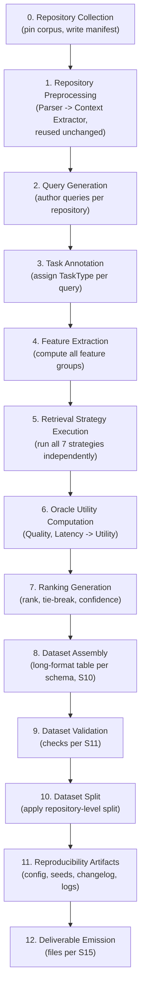

# DATASET_BUILDER_SPEC.md

## RTS Dataset Builder: Engineering Specification

**Status.** Engineering specification, not a research proposal. Everything described here is a concrete build target. No component described here has been implemented. Execution is blocked on Milestones 5–7 (`ROADMAP.md`) at minimum — every one of the seven candidate retrieval strategies must be executable before Retrieval Strategy Execution (§7) can run — and benefits from, but does not strictly require, Milestone 9 (Generation) for the higher-fidelity generation-quality oracle variant noted in §8.

**Naming note.** "RTS" here means **Retrieval Training Set**, the identical artifact `docs/DATASET_DESIGN.md` names the **Router Training Set** — one dataset, one acronym, two names used across this project's documents. This specification adopts "Retrieval Training Set" as authoritative going forward; `docs/DATASET_DESIGN.md` is not edited by this document but should be read as referring to the same thing.

**Relationship to prior documents.** This specification implements: the dataset design and repository/query/split discipline of `docs/DATASET_DESIGN.md` and `DATASET_PLAN.md`; the Learning-to-Rank reformulation and feature-group taxonomy of `docs/methodology/RANKER_DESIGN.md`, including that document's requirement that the **full per-strategy utility vector**, not only a single best-strategy label, be retained (§8, §10 below resolve this requirement concretely); and the reproducibility discipline of `EVALUATION_PROTOCOL.md` §7/§14. Where this document narrows an open question left in those documents (e.g., an exact tie-breaking threshold, an exact $\lambda$ default), that narrowing is stated as a **proposed default requiring pilot calibration**, not a settled constant, consistent with this project's standing discipline of marking untested assumptions rather than presenting them as final.

---

## 1. Objective

RTS exists to supply the training data the Learning-to-Rank router (`docs/methodology/RANKER_DESIGN.md`) requires: for every labeled query, a full utility score for every one of the seven `RoutingStrategy` candidates, from which a ranking, a best-strategy label, and a confidence value are all derived — not a single classification label with the other six candidates' information discarded. Its outputs must be: (a) sufficient to train and validate the ranking model specified in `RANKER_DESIGN.md`; (b) directly reusable, without a translation layer, by the existing evaluation infrastructure (`EXPERIMENT_PLAN.md`, `EVALUATION_PROTOCOL.md`) so the learned ranker becomes a new system variant in that existing experimental design rather than the subject of a separate one; and (c) built once, versioned, and never silently regenerated between reported results.

## 2. Dataset Pipeline

Twelve stages, executed in order. Stages 6–7 cannot execute until the retrieval strategies they invoke exist (`ROADMAP.md` M5–M7); every earlier stage can be built and tested against synthetic or partial data in the meantime.

| Stage | Reuses (unchanged) | Produces |
|---|---|---|
| 0. Repository Collection | — | `repository_manifest.json` |
| 1. Repository Preprocessing | `tara.parsing.TreeSitterRepositoryParser`, `tara.context.GraphBuilder`, `tara.context.SymbolIndexBuilder`, optionally `tara.context.RepositoryEmbedder` | One `RepositoryContext` per manifest repository |
| 2. Query Generation | — | Query text records, keyed by repository |
| 3. Task Annotation | `tara.classification.HeuristicTaskClassifier` (bulk), human/LLM (gold subset) | `TaskClassification` per query |
| 4. Feature Extraction | `tara.retrieval.utils`, `tara.context` accessors | Feature vectors per §6 |
| 5. Retrieval Strategy Execution | `tara.routing.AdaptiveRouter` (fixed single-policy configuration), `tara.retrieval.LexicalRetriever`, `DenseRetriever`/`GraphRetriever` once implemented, `tara.routing.RetrievalPlanner` | Per-(query, strategy) `RetrievedContext` + measured latency |
| 6. Oracle Utility Computation | `EXPERIMENT_PLAN.md` §3 retrieval-quality metrics, `tara.retrieval.utils.normalize_scores` | `quality_score`, `latency_normalized`, `utility_score` per row |
| 7. Ranking Generation | — | `rank`, `is_best_strategy`, `label_confidence` per row |
| 8. Dataset Assembly | — | Unvalidated long-format table |
| 9. Dataset Validation | — | Validation report; rejected/flagged rows |
| 10. Dataset Split | `DATASET_PLAN.md` §6–§8 split assignment (reused, not recomputed) | Split column populated |
| 11. Reproducibility Artifacts | `EVALUATION_PROTOCOL.md` §7 seed policy | Config, seed record, changelog entry |
| 12. Deliverable Emission | — | Files listed in §15 |

## 3. Repository Collection

Reuses `DATASET_PLAN.md` §2–§8 unchanged; this section restates only what an implementer needs without re-deriving the rationale.

**Eligibility criteria** (all required): MIT/Apache-2.0/BSD license; at least one commit in the preceding 12 months; contributes to per-language and per-domain minimums (`DATASET_PLAN.md` §3, §5); not a fork/vendor/submodule of another corpus member; durable public hosting; no active licensing dispute at selection time.

**Repository metadata schema** (`repository_manifest.json`, one record per repository):

| Field | Type | Description |
|---|---|---|
| `repository_id` | string | Stable internal identifier, e.g. `repo-0001` |
| `source_url` | string | Public repository URL |
| `commit_sha` | string | Pinned commit, frozen before annotation begins |
| `language` | enum (`Language`, 8 values) | Primary language |
| `size_bucket` | enum: `small`, `medium`, `large` | Per `DATASET_PLAN.md` §4 |
| `domain` | string | Per `DATASET_PLAN.md` §5's working domain taxonomy |
| `split` | enum: `train`, `validation`, `test` | Repository-level split (§12) |
| `file_count` | int | From `RepositoryContext.file_count` after Stage 1 |
| `symbol_count` | int | From `RepositoryContext.symbol_count` after Stage 1 |
| `license` | string | SPDX identifier |
| `pinned_at` | date | Date the commit was pinned |

## 4. Query Generation

Reuses the query-authoring protocol of `DATASET_PLAN.md` §10 (issue-tracker-style, code-review-comment-style, onboarding-question-style framings, rotated per query, authored without consulting `tara.classification.heuristics`'s vocabulary) and the coverage targets of `DATASET_DESIGN.md` §6: validation and test splits at exactly TIQS's existing query population; the train split expanded toward a proposed **2,000–5,000 query target**, stratified toward ~37 queries per `TaskType` and the 40/25/35 train/validation/test allocation already established.

**Representative examples**, one per framing style, reused from this project's own canonical worked examples for consistency (`README.md`, `PROJECT_SPEC.md` §17):

| Framing | Example |
|---|---|
| Issue-tracker-style | "Where is JWT implemented?" |
| Code-review-comment-style | "Refactor RepositoryParser" |
| Onboarding-question-style | "Explain RepositoryContextExtractor" |

## 5. Task Annotation

Assigns a `TaskType` to every query. Distinguish this explicitly from Oracle Utility Computation (§8): `TaskType` here becomes an **input feature** to the ranker (Task Features, §6), not the ranker's supervision target — the supervision target is the per-strategy utility vector. Using the already-implemented, already-tested classifier to populate an input feature carries none of the circularity risk that using it to generate the ranker's own training *label* would.

- **Manual.** Human double-annotation plus adjudication, identical to `DATASET_PLAN.md` §10, reserved for TIQS's original validation/test queries and a gold calibration subset of the expanded train-split queries. Cohen's κ ≥ 0.6 threshold, unchanged.
- **Heuristic.** For the bulk of the expanded train-split queries, `tara.classification.HeuristicTaskClassifier` is run directly and its output accepted as-is whenever `TaskClassification.confidence` exceeds a threshold (**proposed default: 0.7**, pilot-calibrated). This is the primary, scalable labeling path.
- **LLM-assisted.** For queries where heuristic confidence falls below the threshold, or the query falls outside the classifier's designed vocabulary (non-English, non-Latin identifiers), an LLM is prompted to suggest a `TaskType`, subject to the same circularity mitigation already specified for LLM-assisted `best_strategy` labeling (`DATASET_DESIGN.md` §4): the prompt must not expose `tara.classification`'s own taxonomy or keyword sets, only the 13 category names and a domain-neutral one-line description of each.
- **Future improvements.** A learned `TaskType` classifier (`CONTRIBUTIONS.md` §7's top-priority future work) would eventually replace the heuristic-plus-LLM-assisted bulk path; an active-learning loop prioritizing human review toward the lowest-confidence heuristic labels is a lower-effort interim improvement.

## 6. Feature Extraction

Six groups, refining `RANKER_DESIGN.md` §3's five by splitting graph-topology signals out of the broader "Structural" group into their own "Graph Features" group, for implementation clarity. Query, Task, Repository, Structural, and Graph Features are **shared**: identical across all seven strategy rows for a given query. Resource Features are **candidate-conditioned**: they vary by row, since they describe each strategy's own cost and compatibility. This distinction is load-bearing, not cosmetic (`RANKER_DESIGN.md` §3) — without it, no ranking signal would exist across the seven rows at all.

| Group | Feature name | Type | Description |
|---|---|---|---|
| Query | `query_text` | string | Raw query text (retained for reference/embedding, not itself numeric) |
| Query | `query_token_count` | int | Token count post-`tokenize_for_search` |
| Query | `query_char_length` | int | Raw character length |
| Query | `query_quoted_identifier_count` | int | Count from `extract_quoted` |
| Query | `query_detected_symbol_count` | int | `len(TaskClassification.detected_symbols)` |
| Query | `query_detected_file_path_count` | int | `len(TaskClassification.detected_file_paths)` |
| Query | `query_has_multi_clause` | bool | Coordinating-conjunction indicator |
| Query | `query_embedding` | float[] (nullable) | Optional dense embedding; present only if this feature group is enabled (`RANKER_DESIGN.md` §3) |
| Task | `task_type` | enum (13) | From `TaskClassification.task_type` |
| Task | `task_confidence` | float [0,1] | From `TaskClassification.confidence` |
| Task | `task_graph_required` | bool | From `TaskClassification.graph_required` |
| Task | `task_semantic_required` | bool | From `TaskClassification.semantic_required` |
| Task | `task_lexical_required` | bool | From `TaskClassification.lexical_required` |
| Task | `task_reasoning_required` | bool | From `TaskClassification.reasoning_required` |
| Task | `task_language_hint` | enum (8, nullable) | From `TaskClassification.language_hint` |
| Task | `task_extracted_keyword_count` | int | `len(TaskClassification.extracted_keywords)` |
| Repository | `repo_language` | enum (8) | From manifest |
| Repository | `repo_domain` | string | From manifest |
| Repository | `repo_size_bucket` | enum (3) | From manifest |
| Repository | `repo_file_count` | int | From `RepositoryContext.file_count` |
| Repository | `repo_symbol_count` | int | From `RepositoryContext.symbol_count` |
| Graph | `graph_node_count` | int | From `RepositoryContext.graph.number_of_nodes()` |
| Graph | `graph_edge_count` | int | From `RepositoryContext.graph.number_of_edges()` |
| Graph | `graph_density` | float | `edges / max(nodes, 1)` |
| Graph | `graph_is_populated` | bool | `graph_node_count > 1` |
| Structural | `embedding_available` | bool | `bool(RepositoryContext.embeddings)` |
| Structural | `embedding_dimension` | int (nullable) | From `RepositoryContext.embedding_dimension` |
| Structural | `symbol_index_size` | int | `len(RepositoryContext.symbol_index)` |
| Structural | `docstring_coverage_ratio` | float [0,1] | Fraction of indexed symbols with a non-null docstring |
| Resource *(per-row)* | `strategy_name` | enum (7) | The row's candidate `RoutingStrategy` |
| Resource *(per-row)* | `strategy_requires_graph` | bool | `RetrieverKind.GRAPH in STRATEGY_RETRIEVERS[strategy_name]` |
| Resource *(per-row)* | `strategy_requires_dense` | bool | `RetrieverKind.DENSE in STRATEGY_RETRIEVERS[strategy_name]` |
| Resource *(per-row)* | `strategy_requires_lexical` | bool | `RetrieverKind.LEXICAL in STRATEGY_RETRIEVERS[strategy_name]` |
| Resource *(per-row)* | `strategy_retriever_count` | int | `len(STRATEGY_RETRIEVERS[strategy_name])` |
| Resource *(per-row)* | `strategy_cost_rank` | int | Position implied by `RETRIEVER_EXECUTION_PRIORITY` |
| Resource *(per-row)* | `strategy_graph_compatible` | bool | `strategy_requires_graph AND graph_is_populated` |
| Resource *(per-row)* | `strategy_dense_compatible` | bool | `strategy_requires_dense AND embedding_available` |

All enum-typed and mapping-derived features (`STRATEGY_RETRIEVERS`, `RETRIEVER_EXECUTION_PRIORITY`) are read directly from `tara.routing.strategy`, not redefined for the dataset builder — a duplicated copy of this mapping would risk silently drifting from the one the live routing system actually uses.

## 7. Retrieval Strategy Execution

Each of the seven `RoutingStrategy` candidates is executed **independently** for every query, so that all seven utility values in a query's row-group are directly comparable — no candidate's execution may depend on another's outcome.

**Mechanism.** For a given query and target strategy $s$, a `RoutingDecision` fixing `strategy = s` (and the corresponding `retrievers` from `STRATEGY_RETRIEVERS[s]`) is constructed directly, bypassing policy selection, and handed to the existing, unmodified `RetrievalPlanner`. This is the identical mechanism already used to construct fixed-strategy baselines B1/B2 in `EXPERIMENT_PLAN.md` §4 (an `AdaptiveRouter` built with a restricted, single-policy tuple) — reused here rather than re-implemented, so that oracle labels are generated under **exactly** the execution semantics the live system would use for that strategy, not a parallel path that could silently diverge from it.

**Two oracle variants, sequenced by dependency:**

| Variant | Quality signal | Requires |
|---|---|---|
| v1 (default) | Retrieval-quality metric (Recall@k against TIQS ground-truth relevant-context, `EXPERIMENT_PLAN.md` §3) | Milestones 5–7 only |
| v2 (preferred where available) | Generation-quality metric (`EXPERIMENT_PLAN.md` §3) | Milestones 5–9 |

**Latency measurement.** Wall-clock execution time is recorded per (query, strategy) row, on a single, disclosed, fixed hardware configuration (`EVALUATION_PROTOCOL.md` §8) held constant across every row in the dataset — a latency value measured on inconsistent hardware would not be comparable across rows and must not be mixed into one dataset. To reduce measurement noise, each (query, strategy) execution is run **three times**, with the median latency retained.

## 8. Oracle Utility Computation

$$\text{Utility}(Q, R, s) = \text{Quality}(Q, R, s) - \lambda \cdot \text{Latency}_{\text{norm}}(Q, R, s)$$

| Variable | Definition |
|---|---|
| $\text{Quality}(Q,R,s)$ | The Stage 5 quality metric (Recall@k, or the generation-quality composite where v2 is used), already bounded to $[0,1]$ by construction of those metrics |
| $\text{Latency}_{\text{norm}}(Q,R,s)$ | The row's raw `latency_ms` (§7), min–max normalized to $[0,1]$ **across the seven candidates for the same query only** — computed with the existing `tara.retrieval.utils.normalize_scores` function, reused unchanged rather than reimplemented, applied to the 7-element latency vector per query |
| $\lambda$ | The quality–latency trade-off coefficient. **Proposed default: $\lambda = 0.1$**, reflecting this project's stated priority ordering (retrieval/generation quality, H2/H3, as primary; efficiency, H4, as secondary) — explicitly **not** a validated constant. §14 requires a $\lambda$-sensitivity sweep (proposed sweep set: $\{0.0, 0.05, 0.1, 0.2, 0.5\}$) before any single value is frozen for the released dataset version |

Because $\text{Latency}_{\text{norm}}$ is normalized within each query's own 7-candidate group rather than globally, $\lambda$'s effective meaning is stable across queries regardless of any given query's absolute latency scale: it always represents "how much a maximally-slower-than-its-peers candidate is penalized relative to a maximally-higher-quality one, for this query." A direct consequence, stated explicitly because it shapes how any model trained on this data should be interpreted: encoding $\lambda \cdot \text{Latency}_{\text{norm}}$ directly into the oracle label means a ranker trained on RTS is trained to be efficiency-aware **by construction of the label itself**, not only evaluated for efficiency after the fact.

## 9. Ranking Generation

For each query, the seven `(strategy, utility_score)` pairs are sorted by descending `utility_score` to produce `rank ∈ {1, ..., 7}` per row; `is_best_strategy = (rank == 1)`.

**Tie handling.** Two candidates are considered tied if $|\text{Utility}(s_i) - \text{Utility}(s_j)| < \varepsilon$. **Proposed default: $\varepsilon = 0.02$**, pilot-calibrated, not fixed in advance. Among tied candidates, rank order is broken by ascending `strategy_cost_rank` (the cheaper strategy ranks higher) — reusing the same `RETRIEVER_EXECUTION_PRIORITY`-derived cost ordering already used elsewhere in this project, per the tie-breaking policy already specified conceptually in `DATASET_DESIGN.md` §4 and made quantitative here.

**Confidence.** A single scalar per query (repeated across that query's seven rows in the long-format table, §10):

$$\text{label\_confidence} = \operatorname{clip}\!\left(\frac{\text{Utility}_{(1)} - \text{Utility}_{(2)}}{\max(\text{Utility}_{(1)}, \epsilon_0)}, \; 0.0, \; 1.0\right)$$

where $\text{Utility}_{(1)}$ and $\text{Utility}_{(2)}$ are the top-1 and top-2 utility values after ranking, and $\epsilon_0$ is a small constant (e.g. $10^{-6}$) preventing division by zero when the top utility is itself near zero. This is a relative margin, not an absolute one, so its scale does not depend on the absolute range utility scores happen to occupy for a given query.

## 10. Dataset Schema

**Primary table**, long format — one row per `(query, strategy)` pair, seven rows per query, grouped by `group_id` for direct compatibility with the recommended LightGBM LambdaRank-style training input (`RANKER_DESIGN.md` §5).

| Column | Type | Description |
|---|---|---|
| `query_id` | string | Unique id for the query |
| `group_id` | string | Equal to `query_id`; explicit alias for LTR grouping tooling |
| `repository_id` | string | FK to `repository_manifest.json` |
| `commit_sha` | string | Denormalized from the manifest for row-level provenance |
| `split` | enum: `train`/`validation`/`test` | Repository-level split (§12) |
| `query_text` | string | Raw query |
| `strategy_name` | enum (7) | This row's candidate `RoutingStrategy` |
| *(all Query/Task/Repository/Graph/Structural/Resource columns)* | — | Per §6 |
| `quality_score` | float [0,1] | $\text{Quality}(Q,R,s)$ |
| `latency_ms` | float | Median measured raw latency (§7) |
| `latency_normalized` | float [0,1] | $\text{Latency}_{\text{norm}}(Q,R,s)$ |
| `utility_score` | float | $\text{Utility}(Q,R,s)$ (§8) |
| `rank` | int [1,7] | This row's rank within its query group |
| `is_best_strategy` | bool | `rank == 1` |
| `label_confidence` | float [0,1] | Query-level, repeated per row (§9) |
| `label_source` | enum: `oracle`/`llm_assisted`/`human` | Provenance tier for this row's utility value |
| `annotation_timestamp` | datetime | When this row's label was produced |
| `annotator_id` | string (nullable) | Set only for human-labeled rows |

**Repository manifest table**: as specified in §3.

## 11. Dataset Validation

- **Duplicates.** Exact `query_text` duplicates within the same `repository_id`; duplicate `query_id` values anywhere in the table.
- **Missing values.** Per-column null-rate check. `embedding_dimension`, `query_embedding` legitimately null when the corresponding feature group is disabled or embeddings are unavailable for that repository — distinguished explicitly from any other column being null, which indicates a pipeline defect, not an expected condition.
- **Outliers.** `latency_ms` values more than 5× a query group's median latency are flagged for manual inspection (likely execution failure, not genuine slowness) rather than silently retained; `utility_score` values outside $[-\lambda, 1]$ (the theoretical bound given $\text{Quality} \in [0,1]$ and $\text{Latency}_{\text{norm}} \in [0,1]$) indicate a computation defect and block dataset release until resolved.
- **Repository leakage.** Mechanically verify every row's `(repository_id, split)` pair matches the manifest's declared split, and that no `repository_id` appears under more than one `split` value anywhere in the table — automated, not spot-checked, mirroring the existence-check discipline already established for TIQS (`DATASET_PLAN.md` §12).
- **Group completeness.** Every `group_id` must have exactly seven rows, one per `RoutingStrategy` member, with no candidate silently missing.

## 12. Dataset Split

RTS uses `DATASET_PLAN.md` §6–§8's repository-level train/validation/test split **unchanged** — no independent split logic is introduced by this specification. Repository overlap across splits is forbidden because it would directly invalidate the cross-repository generalization metric this dataset exists to support (`RANKER_DESIGN.md` §7): if a repository appeared in both `train` and `test`, a model's strong test-split performance on that repository's queries would reflect having already seen that repository's structural idiosyncrasies during training, not genuine generalization to an unseen codebase — precisely the confound repository-level (rather than query-level) splitting was adopted throughout this project specifically to prevent (`DATASET_PLAN.md` §9).

## 13. Reproducibility

- **Random seeds.** Any stochastic step in the pipeline (LLM sampling temperature > 0 during Task Annotation, §5; any randomized subsampling for validation spot-checks, §11) follows the master-seed-plus-derived-per-component-seed policy already specified in `EVALUATION_PROTOCOL.md` §7, applied to this pipeline rather than redefined for it.
- **Configuration files.** A single versioned configuration artifact (proposed location: `evaluation/datasets/rts/config.yaml`) records every externally-tunable value this specification names as a proposed default: $\lambda$, $\varepsilon$, the heuristic-confidence threshold (§5), the query-embedding-feature toggle, and the repository manifest reference — no such value is hardcoded in a way that would require a document change to adjust.
- **Versioning.** Semantic-version tags (`v0.1-pilot`, `v1.0`, ...), immutability once tagged, and a changelog entry for every subsequent version — identical discipline to `DATASET_PLAN.md` §14, applied to this artifact.
- **Logging.** Each pipeline stage (§2) emits structured log records (start/end timestamp, row counts produced, validation outcomes, errors/warnings) via the existing `tara.core.logging` conventions, retained per run under a timestamped log directory (§15) — this pipeline is research/data-engineering code (`PROJECT_SPEC.md` §14, design principle 7; `ROADMAP.md` M10's lighter testing bar applies to it), but structured logging is retained regardless, since traceability of *how a released dataset version was produced* is a reproducibility requirement independent of the code's testing rigor.

## 14. Risks

- **Oracle bias.** The Utility formula's $\lambda$ and the choice of `Quality` metric are pipeline configuration, not neutral defaults — an unexamined $\lambda$ could systematically favor cheap-but-mediocre or slow-but-thorough strategies without that bias being visible anywhere except the released labels themselves. Mitigation: the $\lambda$-sensitivity sweep required before freezing a value (§8), disclosed alongside the released dataset version.
- **Task ambiguity.** Some queries will not cleanly fit any single `TaskType` (a known difficulty already surfaced during TIQS annotation, `DATASET_PLAN.md` §12–§13). Mitigation: the same escalation-to-adjudication path already specified for TIQS, applied here rather than silently forcing a low-confidence heuristic label through.
- **Repository evolution.** Pinned commits (§3) fully resolve this for *reproducibility* of a given dataset version, but do not resolve the underlying concern that a repository's later, evolved state (e.g., after gaining populated call-graph edges per a future `ROADMAP.md` M7 extension) may differ materially from the state RTS's labels were computed against — a limitation to state at release time, not a defect in this pipeline.
- **Label noise.** Compounds across every upstream source: heuristic `TaskType` misclassification, LLM-assisted labeling error, retrieval-quality metric noise inherited from TIQS's own ground-truth subjectivity (`DATASET_PLAN.md` §17), and latency measurement variance. Mitigation for the latency component specifically: three-run median measurement (§7); mitigation for the remainder is the validation program in §11, not elimination.

## 15. Deliverables

| File | Contents |
|---|---|
| `evaluation/datasets/repository_manifest.json` | Repository metadata table (§3) |
| `evaluation/datasets/rts/rts_v{version}.jsonl` | The primary long-format dataset table (§10), one JSON object per row, chosen over a binary format for diff-based version review (`DATASET_PLAN.md` §14's diffability rationale, applied here) |
| `evaluation/datasets/rts/config.yaml` | Frozen pipeline configuration for the corresponding dataset version (§13) |
| `evaluation/datasets/rts/CHANGELOG.md` | Per-version change history |
| `evaluation/datasets/rts/validation_report_v{version}.md` | Output of every check in §11 for that version's build |
| `evaluation/datasets/rts/annotation_guidelines.md` | Query-authoring and task-annotation protocol specifics for RTS's expanded train split (extends, does not duplicate, `DATASET_PLAN.md`'s TIQS guidelines) |
| `evaluation/datasets/rts/logs/{run_timestamp}/` | Structured per-stage logs for a given pipeline run (§13) |
| `evaluation/datasets/rts/README.md` | Human-readable dataset card: purpose, construction summary, taxonomy, known limitations, license, citation |
