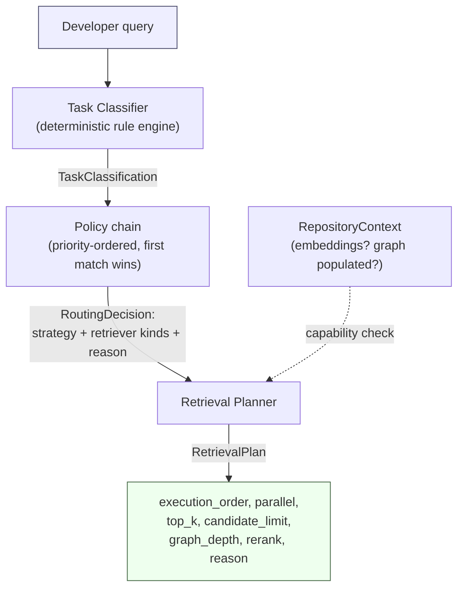

# Adaptive Retrieval: Definition and Methodological Foundations

**Status:** Research methodology document. Defines the conceptual construct TARA operationalizes, distinct from `PROJECT_SPEC.md` (system specification) and `EXPERIMENT_PLAN.md`/`EVALUATION_PROTOCOL.md` (how that construct is tested). No implementation guidance belongs here.

## How to read this document

Every substantive claim below is tagged with exactly one of the following, because this document's entire purpose is to keep these three categories from blurring together:

- **[Established]** — general knowledge already supported by prior literature or standard practice, not specific to TARA. TARA did not invent this; it is the backdrop TARA's design decisions are made against.
- **[TARA Design — Implemented]** — a specific choice TARA has made and that exists in the current codebase today (cross-referenced to `DESIGN_DECISIONS.md` where applicable).
- **[TARA Design — Proposed]** — a specific choice that is part of TARA's design intent but is **not yet implemented**.
- **[Assumption — Requires Validation]** — a premise the current design depends on that has not been empirically tested within this project. These are candidates for the hypotheses in `PROJECT_SPEC.md` §6 and `EXPERIMENT_PLAN.md`, not settled facts.

Where a single idea mixes categories (common — e.g., a general principle applied in a TARA-specific way), the tags are applied to the specific clauses they cover, not the whole paragraph.

---

## 1. Definition of Adaptive Retrieval

**[Established]** *Adaptive retrieval*, in the general information-retrieval and retrieval-augmented-generation sense, refers to any retrieval system in which the retrieval strategy — which mechanism is used, how many results are fetched, whether multiple mechanisms are combined — is a function of the query (and/or other contextual signals) rather than fixed in advance. This is not a new idea: query-type-conditioned retrieval predates RAG entirely (classical IR query classification for search-engine routing), and within RAG specifically, a growing line of work varies retrieval behavior based on query properties, retrieved-result quality, or model uncertainty rather than always retrieving the same way. This project's related-work review (`PROJECT_SPEC.md` §4) situates TARA within this space and names the closest specific systems (AIRCoder, RepoFormer, AllianceCoder, RepoGraph, STALL+); the general *concept* of adaptivity is common ground with that literature, not something claimed as new here.

**[TARA Design — Implemented]** For the purposes of this project, adaptive retrieval is defined operationally as:

> A pipeline stage that, given a developer query and the current state of a target repository, selects — deterministically and before any retrieval executes — one of a fixed, enumerable set of retrieval strategies and configures its execution parameters, such that this selection can vary across queries and across repositories without any change to the underlying retriever implementations.

This definition is deliberately narrow relative to the general concept above: it excludes anything that adapts *during* or *after* retrieval (see §9), and it excludes gradient/continuous strategy mixing in favor of discrete selection from a closed set (`tara.routing.strategy.RoutingStrategy`, 7 members; `DESIGN_DECISIONS.md` §2). **[Assumption — Requires Validation]** That this narrower, single-pass, discrete-selection operationalization is an adequate instance of the general concept — sufficient to capture most of adaptive retrieval's practical benefit for this problem — is itself an assumption under test, not a premise established elsewhere.

## 2. Why Static Routing Is Insufficient

**[Established]** A retrieval system that always uses the same mechanism (e.g., always dense/semantic search) treats every query as if it had the same information need shape, which is a well-documented limitation across IR generally: exact-identifier lookups, broad conceptual questions, and structural/relational questions are known to be served better by different retrieval mechanisms (lexical/exact match, dense/semantic similarity, and graph/structural traversal, respectively), and no single mechanism dominates across all three.

**[TARA Design — Implemented]** Within the repository-level code generation setting specifically, this project's own worked examples (`README.md`, `PROJECT_SPEC.md` §17–§18) instantiate this general point concretely: an exact-symbol query (*"Find `parse_repository`"*), a conceptual-explanation query (*"Explain `RepositoryContextExtractor`"*), and a structural-tracing query (*"Trace login flow"*) are shown to route to three different strategies (`LEXICAL_ONLY`, `SEMANTIC_ONLY`, `GRAPH_ONLY` respectively) under TARA's implemented router, verified end-to-end against the real classifier (`tests/routing/test_router.py`). This demonstrates that the three query *shapes* are distinguishable and that TARA's router does in fact distinguish them mechanically — it does **not** by itself demonstrate that distinguishing them produces better retrieval or generation outcomes than not distinguishing them would. That comparison is exactly what `EXPERIMENT_PLAN.md`'s baseline family (B1 fixed-semantic, B2 fixed-full-pipeline) is designed to test.

**[Assumption — Requires Validation]** The premise that static routing is *insufficient specifically for this project's target setting* (repository-level code generation, the corpus and query distribution described in `DATASET_PLAN.md`) — as opposed to merely being insufficient in IR generally — is the assumption H2 (`PROJECT_SPEC.md` §6) exists to test.

## 3. Why Software-Engineering Task Awareness Matters

**[Established]** General adaptive-RAG approaches typically condition routing on query *properties* directly observable from the query itself (ambiguity, estimated difficulty, retrieval-result confidence) rather than on an explicit *task-type* label. Conditioning on task type is a stronger, more structured claim: it asserts that a small number of recognizable *categories of developer intent* exist and that category membership is itself a useful routing signal, above and beyond generic query-difficulty signals.

**[TARA Design — Implemented]** TARA's specific claim is that software-engineering task type is a useful such category system, and it operationalizes this via a 13-member taxonomy (`tara.core.types.TaskType`) purpose-built for routing, plus a separate, broader 6-category semantic taxonomy (`docs/task_taxonomy.md`) analyzing *why* task type should matter per category — e.g., Refactoring's need for *exhaustive recall* of usages versus Documentation's need for *rationale-bearing* context versus API Usage's need for a *small number of representative examples*. These are qualitatively different retrieval requirements that a query-difficulty-only signal would not obviously distinguish (a "hard" refactoring query and a "hard" documentation query could look equally difficult by generic measures while needing opposite retrieval behavior — exhaustive recall versus curated precision).

**[Assumption — Requires Validation]** That task type, specifically, is a *better* routing signal than generic query-difficulty/complexity signals (§4) — rather than merely *a* usable signal — is not established by the reasoning above; it is a comparative claim requiring the two to be tested against each other, which the current experimental design (`EXPERIMENT_PLAN.md`) does not yet explicitly do (it tests task-aware routing against *fixed*-strategy baselines, not against a *complexity-aware-but-task-agnostic* alternative router). This is noted as a gap in the current experimental design, not only as a foundational assumption — see §10.

## 4. Candidate Routing Inputs

Each candidate input below is marked by its actual status in the current system, not by whether it is a reasonable thing to consider — several are reasonable and simply not yet built.

### Task

**[TARA Design — Implemented]** The primary, currently dominant routing input. `TaskClassification` (`tara.classification.models`) supplies a 13-way task-type label, three boolean requirement flags (`graph_required`, `semantic_required`, `lexical_required`), a `reasoning_required` flag, and a confidence score. The router's policy chain (`tara.routing.policies`, `DESIGN_DECISIONS.md` §2) consumes these directly and is, today, the *only* input that influences which `RoutingStrategy` is selected in the first place.

### Repository Characteristics

**[TARA Design — Implemented, narrowly]** Repository state is consulted today, but only as a **post-selection capability gate**, not as a signal that influences *which* strategy is chosen in the first place: `RetrievalPlanner` checks whether `RepositoryContext.embeddings` is non-empty and whether the graph has more than one node, and *downgrades* an already-chosen strategy if the repository can't actually support it (`DESIGN_DECISIONS.md` §2, decision on the planner). **[TARA Design — Proposed]** Using richer repository characteristics (size, dominant language, domain — the same dimensions `DATASET_PLAN.md` §3–§5 stratifies the evaluation corpus by) as a **proactive** input to strategy *selection itself* (e.g., a small repository might make exhaustive lexical search cheap enough to always include) is not implemented and is a candidate future extension.

### Query Complexity

**[TARA Design — Proposed, not implemented]** No explicit query-complexity score exists in the current pipeline. The classifier's `confidence` field and `reasoning_required` flag are adjacent proxies (a low-confidence or reasoning-flagged query is arguably a more "complex" one) but neither was designed to measure complexity directly, and neither currently feeds into strategy selection beyond how they already shape the classification itself. A dedicated complexity signal (e.g., detected-symbol count, sub-question count, query length) feeding routing directly is an open design question, connected to §3's open gap.

### Graph Availability

**[TARA Design — Implemented]** The one repository characteristic that *is* already consulted, specifically: `RetrievalPlanner` checks `context.graph.number_of_nodes() <= 1` and drops the `GRAPH` retriever if the graph is trivial, falling back toward `LEXICAL` (`DESIGN_DECISIONS.md` §2). As with the general repository-characteristics case above, this is reactive (a downgrade of an already-selected strategy), not a proactive input to the initial selection.

### Latency Budget

**[TARA Design — Proposed, not implemented]** No notion of a per-query latency budget or SLA exists anywhere in the current pipeline. `RetrievalPlan` records the *predicted* efficiency consequences of a choice (`parallel`, `top_k`, `candidate_limit`) but nothing today consumes an externally supplied latency constraint to influence the choice itself. Introducing one would let routing trade quality for speed under an explicit budget rather than TARA's current implicit efficiency stance (cheaper strategies chosen only when the classification signals warrant them, never because of a stated time constraint).

### Token Budget

**[TARA Design — Proposed, not implemented — status distinct from the other proposed inputs]** A token budget is anticipated *elsewhere* in the pipeline: it is Context Fusion's documented responsibility to truncate a fused context to a token budget (`DESIGN_DECISIONS.md` §8, `PROJECT_SPEC.md` §20), and is expected to exist once that stage is implemented. What is **not** planned, and would be a genuine extension beyond current design intent, is a token budget influencing *routing* itself — e.g., a router preferring a strategy with a smaller expected token footprint under a tight downstream budget. Today, token-budget reasoning is entirely downstream of routing, never an input to it.

## 5. Candidate Routing Outputs

**[TARA Design — Implemented]** The current output is `RetrievalPlan` (`tara.routing.models`): a discrete `RoutingStrategy`, the concrete `RetrieverKind`s to run, their execution order, a parallel/sequential flag, graph traversal depth and neighbor-expansion flag, a rerank flag, `top_k` and `candidate_limit`, and a human-readable `reason` string. This is a complete specification of *what* to retrieve with and *how*, but not of any expected outcome.

**[TARA Design — Proposed, not implemented]** Candidate additional outputs, none currently part of the contract:

- **A routing-specific confidence score**, distinct from the classifier's own confidence — expressing how confident the *router* is in its strategy choice given the classification, which could differ from classification confidence (a highly-confident classification could still map ambiguously onto strategy space, or vice versa).
- **An estimated cost/latency accompanying the plan**, enabling a caller to reason about the plan's likely expense before executing it, relevant if §4's latency-budget input is ever added.
- **A fallback/contingency strategy**, to be tried if the primary strategy's execution yields insufficient results (e.g., zero candidates) — today, an empty result from a chosen strategy is simply an empty result; there is no secondary attempt.
- **A continuous per-retriever weight vector**, as an alternative output shape entirely rather than a discrete strategy — discussed as an alternative design in §9, not a minor addition to the current output.

## 6. Decision Flow

**[Established]** The general pattern — analyze the query, select a strategy, configure execution parameters for that strategy — is a standard three-phase shape for query-adaptive retrieval systems generally, independent of TARA.

**[TARA Design — Implemented]** TARA's specific realization of this pattern, per `DESIGN_DECISIONS.md` §2:

Two properties of this flow are worth stating explicitly because they are TARA-specific design choices, not forced by the general pattern:

- **[TARA Design — Implemented]** Strategy selection (the policy chain) and execution-parameter configuration (the planner) are two separate, independently testable steps, not one combined decision — this is what makes the ablation program in `EXPERIMENT_PLAN.md` §5 possible as configuration changes rather than code forks.
- **[TARA Design — Implemented]** The repository-capability check happens *after* strategy selection, as a downgrade, not *before* it as an input (this is the same point made in §4 for "Repository Characteristics" and "Graph Availability" — restated here because it is a property of the *flow*, not only of the inputs).

## 7. Assumptions

Each assumption below is a premise the current design depends on. None has been empirically validated within this project as of this document.

1. **Task-type sufficiency.** Knowing a query's task-intent category predicts which retrieval strategy serves it best, better than not knowing it — the assumption underlying §3, and the closest thing this document has to a single master assumption; H2/H3 (`PROJECT_SPEC.md` §6) are the direct tests of it.
2. **Discrete-strategy adequacy.** A small, closed, 7-member strategy space is expressive enough to capture the retrieval-need variation across real queries without needing continuous blending (contrast §9).
3. **Three-flag sufficiency.** The boolean triple (`graph_required`, `semantic_required`, `lexical_required`) captures enough routing-relevant signal without a finer-grained (e.g., real-valued) representation.
4. **Deterministic-router adequacy relative to a learned alternative.** A hand-authored, priority-ordered policy chain approximates what a learned router would produce closely enough to be worth deploying ahead of having the labeled data a learned alternative would require — the assumption `CONTRIBUTIONS.md` §1's central falsifiable claim rests on.
5. **Capability-gate sufficiency.** Checking only whether embeddings/graph exist (a binary capability check) is an adequate proxy for "will this retriever actually help here," without reasoning about repository size, domain, or language (§4).
6. **Task-type override generalization.** The `REFACTOR`-specific full-pipeline override (`DESIGN_DECISIONS.md` §2) generalizes better than a purely flag-derived strategy for that task type specifically — directly tested by ablation A2 (`EXPERIMENT_PLAN.md` §5).
7. **Static weight adequacy.** Hand-tuned, fixed relative weights (e.g., a name-field match counting three times a source-text match in lexical scoring) approximate a reasonable importance ordering without per-repository or per-query calibration.

## 8. Risks

- **Construct-validity risk (foundational, not only measurement-level).** The entire premise that task type correlates with retrieval need as strongly as assumed could simply be wrong for this domain — not merely imperfectly measured (the narrower framing in `EXPERIMENT_PLAN.md` §14) but incorrect at the level of the construct itself.
- **Taxonomy misalignment risk.** The 13-category routing taxonomy and the 6-category semantic taxonomy (`docs/task_taxonomy.md`) may not carve query-intent space at its most useful joints; a differently-shaped taxonomy might route better even if "task-type awareness" per se is validated.
- **Circularity / overfit-to-intuition risk.** The taxonomy, the rule engine's keyword sets, and the routing policies were all hand-authored by the people who also designed the evaluation — a design can look internally coherent without being empirically near-optimal, and nothing in the design process itself guards against this (`CONTRIBUTIONS.md` §6 names the same risk for the dataset specifically; here it applies to the routing design itself).
- **Boundary-rigidity risk.** Discrete strategy selection may perform poorly for queries genuinely "between" two categories, producing systematic mis-routing concentrated at taxonomy boundaries rather than uniformly distributed error.
- **Heuristic-generalization risk.** Keyword sets and naming-convention regexes tuned against the current, small train/dev repository split (`DATASET_PLAN.md` §6–§7) may not transfer to repositories, languages, or domains outside that split.
- **Opportunity-cost risk.** The entire routing layer's engineering complexity may not be justified if a much simpler baseline (e.g., always-hybrid, B2) turns out to be nearly as good at much lower complexity cost — this is precisely the falsification condition `CONTRIBUTIONS.md` §1 states in advance, restated here as a risk to the methodology rather than as a finding.

## 9. Alternative Designs

None of the following are adopted in TARA's current design. Each is listed because a reader should be able to see what was considered and why the current design was preferred, not because any is judged inferior in principle.

| Alternative | Description | Why not adopted (v1) |
|---|---|---|
| **Learned/trained router** | A classifier or ranking model trained on labeled `(query, ideal strategy, outcome)` tuples | No such labeled data exists yet; identified as the top-priority future extension (`CONTRIBUTIONS.md` §7), not rejected on principle |
| **LLM-as-router** | Prompt an LLM directly to choose a retrieval strategy | Violates the deterministic/cheap/inspectable design principle central to TARA's own contribution claim (`DESIGN_DECISIONS.md` §1); would also reintroduce the same non-determinism and cost concerns the rule-based classifier was specifically designed to avoid |
| **Contextual bandit / RL routing** | Treat strategy selection as an action optimized against observed downstream reward over many interactions | Requires an online feedback loop and many interactions to converge; better suited to a deployed system accumulating usage data than a research prototype evaluated once against a fixed benchmark |
| **Continuous multi-retriever blending** | Assign continuous weights to every retriever and always run a weighted combination, rather than discretely selecting a subset | More expressive in principle, but sacrifices both the explainability property (a single discrete "why" string) and the efficiency benefit of skipping retrievers entirely for cheap strategies — both explicit parts of TARA's stated contribution |
| **Multi-hop / iterative retrieval** | Retrieve, inspect results, decide whether to retrieve again with a different strategy | Explicitly out of scope for the single-pass design (`PROJECT_SPEC.md` §8); a natural next step, already named as future work (`CONTRIBUTIONS.md` §7) |
| **Query rewriting/decomposition before routing** | Reformulate or split the query prior to classification (as in RQ-RAG-style approaches) | Not adopted in v1; could in principle sit as a preprocessing step ahead of the current classifier without changing the router itself |
| **Ensemble-always** | Always run every retriever and rerank the combined results, with no adaptive selection at all | This is not a hypothetical alternative — it is directly instantiated as baseline B2/B7 in `EXPERIMENT_PLAN.md` §4, so that adaptive selection's value over always-maximal retrieval is a directly measured comparison, not merely an assumption |

## 10. Open Research Questions

These extend `PROJECT_SPEC.md` §5's operationalized RQ1–RQ6 with more foundational questions this document's definitional work surfaces. Not all are currently addressed by the experimental design in `EXPERIMENT_PLAN.md`; where a question is *not* currently tested, that is stated explicitly, since an open question this project cannot currently answer is different from one it has simply not yet run.

1. **(Operationalized — tested)** Do task-aware routing decisions improve retrieval quality, generation quality, and efficiency relative to fixed-strategy baselines? — `PROJECT_SPEC.md` RQ1–RQ4, tested via `EXPERIMENT_PLAN.md`.
2. **(Operationalized — exploratory)** Are routing decisions explainable to a human reader via their `reason` string? — RQ5, tested descriptively only.
3. **(Not currently tested)** Is task type a *better* routing signal than a task-agnostic query-complexity signal, or merely *a* usable signal among several plausible ones? As noted in §3, the current baseline family compares task-aware routing against *fixed*-strategy baselines, not against a complexity-aware-but-task-agnostic alternative — this comparison would require building and testing a new baseline not currently in `EXPERIMENT_PLAN.md` §4.
4. **(Not currently tested)** What is the right granularity for a routing decision — whole-query (current design), sub-query, or per-retrieval-round (relevant only if the multi-hop alternative in §9 is pursued)?
5. **(Not currently tested)** Does the marginal benefit of the richer, currently-unimplemented routing inputs in §4 (query complexity, latency budget, token budget) justify their added complexity over the current Task-plus-capability-gate input space? This requires those inputs to be built before it can be tested at all.
6. **(Not currently tested)** At what point, and with how much labeled data, does a learned router's ceiling surpass a deterministic one's? Directly relevant to Assumption 4 (§7) and the top-priority future-work item in `CONTRIBUTIONS.md` §7, but no experiment currently measures this — it requires the learned-classifier comparison to exist first.

## 11. Research Hypotheses

Restated compactly from `PROJECT_SPEC.md` §6 and `EVALUATION_PROTOCOL.md` §2, with the falsifiable central claim these decompose stated explicitly above them, per `CONTRIBUTIONS.md` §1.

**Central claim (not independently tested as one hypothesis; H1–H5 collectively test it):** Making retrieval-strategy selection an explicit, task-aware, pre-retrieval decision measurably improves retrieval quality, generation quality, or efficiency relative to task-agnostic retrieval, at a complexity cost justified by that improvement.

| ID | Hypothesis | Falsified if |
|---|---|---|
| H1 | The rule-based classifier achieves macro-F1 ≥ 0.75 on TIQS test, with confidence positively correlated with correctness | macro-F1 < 0.75, or the correlation is not significant |
| H2 | TARA's retrieval quality ≥ the strongest fixed-strategy baseline's, at equal-or-lower cost | Quality is significantly lower, or cost is not lower when quality is only equal |
| H3 | TARA's generation quality exceeds fixed semantic-only retrieval on the confidence-gated query subset | No significant, non-trivial improvement on that pre-specified subset |
| H4 | TARA's mean end-to-end latency is lower than always-full-pipeline retrieval's | Latency is not significantly lower, or the efficiency gain isn't attributable to routing a real fraction of queries to cheaper strategies |
| H5 | Low-confidence queries show significantly lower downstream quality than high-confidence ones | No significant difference across confidence deciles |

A negative result on any of these is, per `CONTRIBUTIONS.md` §4, a valid and reportable finding — this document's role is to make clear *which specific premise* (§7) a given negative result would implicate, so that a null result is diagnostic rather than merely disappointing.
