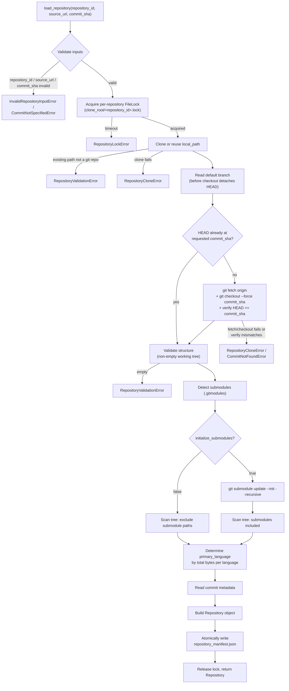

# RTS Builder — Repository Loader (Milestone 1)

The RTS Builder constructs the Retrieval Training Set used to train
TARA's learned router (see [`docs/DATASET_BUILDER_SPEC.md`](../../docs/DATASET_BUILDER_SPEC.md)
and [`docs/methodology/RANKER_DESIGN.md`](../../docs/methodology/RANKER_DESIGN.md)).
It is staged into milestones; this milestone implements only the first
stage: the **Repository Loader**.

> **Revision note:** this module was revised in response to an
> ICSE-style review of v1. Every change below traces back to a specific
> reviewer comment — see [`REVIEW_RESPONSE.md`](REVIEW_RESPONSE.md) for
> the full comment → solution → files-changed → limitations mapping.

## Scope

The Repository Loader is responsible for exactly seven things:

1. Clone a repository from its source URL (or reuse an existing local clone).
2. Check out and **verify** an exact, mandatory commit SHA.
3. Validate the result (non-empty working tree, checked-out commit matches the request).
4. Read commit-level metadata (author, date, message, default branch).
5. Detect the programming language of each file and the repository's dominant language (by byte size).
6. Count files and directories, explicitly accounting for submodules.
7. Return a fully populated `Repository` object, and persist it as `repository_manifest.json`.

It explicitly does **not** parse source files, extract symbols, build a
repository graph, retrieve anything, compute oracle utility, or extract
features — those are later RTS Builder milestones, layered on top of the
`Repository` object this one produces.

## Usage

```python
from evaluation.rts_builder.config import RepositoryLoaderSettings
from evaluation.rts_builder.repository_loader import RepositoryLoader

settings = RepositoryLoaderSettings(clone_root=".rts_cache/repositories")
loader = RepositoryLoader(settings=settings)

repository = loader.load_repository(
    repository_id="psf-requests",
    source_url="https://github.com/psf/requests.git",
    commit_sha="<full 40-character pinned commit sha -- mandatory, never abbreviated>",
)

print(repository.primary_language, repository.file_count, repository.manifest_path)
```

Calling `load_repository()` again with the same `repository_id` reuses
the existing local clone rather than re-cloning. If the reused clone is
pinned to a *different* commit than requested, the loader fetches and
force-checks-out the requested commit before proceeding — reuse never
silently returns stale content.

## Configuration

All settings are optional and environment-driven via `RepositoryLoaderSettings`
(prefix `RTS_`). See [`.env.example`](.env.example) for the full list
with descriptions:

| Variable | Default | Purpose |
|---|---|---|
| `RTS_CLONE_ROOT` | `.rts_cache/repositories` | Local directory under which repositories are cloned, one subdirectory per `repository_id`. |
| `RTS_CLONE_TIMEOUT_SECONDS` | `300` | Maximum time allowed for a single clone. Enforced on Linux/macOS only — see Failure Modes below. |
| `RTS_IGNORED_DIRECTORIES` | `[]` | Additional directory names excluded from counts, on top of the built-in defaults. |
| `RTS_MAX_FILE_COUNT_WARNING_THRESHOLD` | `100000` | File count above which a warning is logged. |
| `RTS_LOCK_TIMEOUT_SECONDS` | `600` | Maximum wait to acquire a repository's lock before raising `RepositoryLockError`. |
| `RTS_INITIALIZE_SUBMODULES` | `false` | Whether to recursively initialize submodules (and include their content in counts) rather than leaving them uninitialized and excluded. |

## Architecture



`RepositoryLoader` takes both of its collaborators as constructor
arguments rather than constructing them internally:

- `settings: RepositoryLoaderSettings` — clone location, timeout, lock timeout, ignore list, warning threshold, submodule policy.
- `language_registry: LanguageRegistry` — reused from `tara.parsing.language_registry`, the same
  registry `TreeSitterRepositoryParser` uses for per-file language detection.

Reusing `LanguageRegistry` (rather than re-implementing extension-to-language
mapping here) means the Repository Loader's notion of "what language is
this file" can never drift from the main TARA parsing pipeline's.

`load_repository()` acquires a per-`repository_id` lock, then runs a
fixed pipeline of private steps, each with a single responsibility:

```
_clone_or_reuse → _read_default_branch → _ensure_commit_checked_out →
_validate_structure → _detect_submodules → [_initialize_submodules] →
_scan_tree → _determine_primary_language → _read_commit_metadata →
Repository(...) → _write_manifest
```

`_scan_tree` uses an explicit stack rather than recursion (consistent
with `tara.parsing.repository_parser`'s own directory walk) to avoid
Python's recursion limit on deeply nested trees, and counts files,
directories, total bytes, and per-language file counts *and byte
counts* in a single pass.

## Design Decisions

- **Separate `RepositoryLoaderSettings`, not an extension of `TaraSettings`.**
  The RTS Builder is data-construction tooling that *consumes* `tara`
  (see `evaluation/__init__.py`); it is not part of the `tara` package
  itself. Mixing its configuration into `TaraSettings` would blur that
  boundary and couple the core library's config surface to an evaluation
  concern.
- **A locally defined, small `_DEFAULT_IGNORED_DIRECTORIES`, not an import
  of `tara.parsing`'s ignore list.** That constant is private to the
  parsing package and tuned for symbol extraction. Counting files and
  detecting a dominant language is a coarser-grained concern with a
  different (deliberately smaller) set of directories worth excluding.
- **Idempotent clone-or-reuse, keyed on `(repository_id, clone_root)`, now with verified consistency.**
  Building an RTS involves loading the same repositories repeatedly
  across pipeline runs; re-cloning every time would make the loader
  unusable for its actual purpose. An existing local path is trusted as
  long as it's a valid git repository *and* is (or is corrected to be)
  pinned to the exact requested commit — reuse is a performance
  optimization, never a correctness compromise.
- **`commit_sha` is mandatory and must be a full 40-character SHA.**
  The loader never defaults to `HEAD`: every RTS pipeline run must be
  exactly reproducible, and a moving `HEAD` (or an ambiguous abbreviated
  SHA — see `REVIEW_RESPONSE.md` item 1) is incompatible with that.
- **Locking is per-repository, not global.** A single `FileLock` guarding
  *all* repositories would serialize the entire RTS Builder pipeline —
  directly counter to its purpose of loading many repositories in
  parallel across workers. Locking scoped to `repository_id` protects
  exactly the resource that's actually shared (one repository's local
  clone) and nothing more.
- **Input validation lives in this module, not delegated to `git`.**
  `repository_id` and `source_url` are validated *before* any filesystem
  or subprocess operation: `repository_id` against a safe charset (no
  path separators or `..`, making directory-traversal structurally
  impossible rather than merely checked-for), `source_url` against a
  small denylist of tokens that are never valid in a real git URL
  (a leading `-`, which `git` would parse as a flag; shell metacharacters,
  rejected as defense-in-depth even though GitPython already invokes
  `git` via an argument list, never a shell string).
- **Dominant language by total bytes, not file count.** File count is
  a poor proxy for "what this repository actually is" — a handful of
  large source files should outweigh a pile of tiny generated or config
  files. This mirrors GitHub Linguist's approach. `language_distribution`
  (file counts) is kept as a separate, informational field.
- **Submodules excluded by default, not silently miscounted.**
  A plain (non-recursive) clone leaves submodule directories on disk as
  empty placeholders; counting them as real content would be wrong, and
  silently ignoring their *existence* would be worse (later pipeline
  stages need to know a repository has submodules even if their content
  isn't loaded). The default (`initialize_submodules=False`) records
  their paths on `Repository.submodules` and excludes them from every
  count; opting in initializes and includes them, at the cost of
  recursively cloning content this loader doesn't otherwise vet.
- **`repository_manifest.json` written atomically, after full characterization.**
  We interpret "immediately after successful validation" as "as soon as
  the repository has been fully validated *and* characterized" rather
  than a bare pre-scan checkpoint: a manifest lacking file/language
  statistics wouldn't serve the evident purpose of a durable, resumable
  per-repository record. Written via write-to-temp-file-then-atomic-rename
  (`Path.replace`, atomic on both POSIX and Windows) so a crash mid-write
  can never leave a corrupt manifest on disk. Excluded from `_scan_tree`
  by name so its own presence never perturbs a later reload's counts.
- **`Repository` carries no parsed content.** It remains a thin,
  purely descriptive object so later milestones can depend on it
  without this milestone quietly growing responsibilities that belong to
  them.
- **Own exception hierarchy rooted in `tara.core.exceptions.TaraError`.**
  Lets callers that operate across both the TARA retrieval pipeline and
  the RTS Builder catch `TaraError` broadly, while still being able to
  catch (e.g.) `RepositoryLockError` specifically.

## Potential Failure Modes

| Failure | Raised as | Notes |
|---|---|---|
| Empty/malformed `repository_id` (path separators, `..`) | `InvalidRepositoryInputError` | Rejected before any filesystem access; directory traversal is structurally impossible, not merely checked-for. |
| `source_url` starts with `-`, or contains a shell metacharacter | `InvalidRepositoryInputError` | Guards against `git` misreading the URL as a command-line flag (a real argument-injection class). |
| `commit_sha` missing or not a full 40-char hex SHA | `CommitNotSpecifiedError` | The loader never defaults to HEAD or accepts abbreviations. |
| Another worker holds the repository's lock past `lock_timeout_seconds` | `RepositoryLockError` | Cross-platform via `filelock`; per-repository, so unrelated repositories are never blocked by this. |
| Invalid/unreachable source URL, network failure | `RepositoryCloneError` | Wraps the underlying `GitCommandError`. |
| Clone exceeds `clone_timeout_seconds` | `RepositoryCloneError` | **Not enforced on Windows** — see below. |
| Fetch fails while reconciling a reused clone to a different commit | `RepositoryCloneError` | E.g. the remote is now unreachable. |
| Requested commit SHA doesn't exist (even after a fetch) | `CommitNotFoundError` | Raised from the forced-checkout failure, or from a post-checkout verification mismatch. |
| Existing local path at `clone_root/<repository_id>` is not a valid git repo | `RepositoryValidationError` | The loader does not delete or overwrite it. |
| Checked-out working tree has no tracked files | `RepositoryValidationError` | E.g. a repository whose only commit is `--allow-empty`. |
| Submodule initialization fails (`initialize_submodules=True`) | `RepositoryCloneError` | E.g. an unreachable or now-deleted submodule URL. |

**Windows clone-timeout limitation (discovered, not hypothetical):**
GitPython's clone-timeout mechanism (`kill_after_timeout`) raises
`GitCommandError` with `"kill_after_timeout" feature is not supported
on Windows` if used on Windows at all. The loader detects the platform
and only passes `kill_after_timeout` on non-Windows platforms; on
Windows, the clone proceeds with no enforced timeout, and a
`WARNING`-level log message is emitted explaining why. `clone_timeout_seconds`
is currently a no-op on Windows — see "Future Extension Points" for a
real fix.

**Known, minor over-count:** when `initialize_submodules=True`, an
initialized submodule's own working-tree `.git` entry is a *file*
(a gitdir pointer), not a directory — unlike a top-level `.git`
directory, it is not excluded by the directory-name ignore list, so it
is counted as one extra file per initialized submodule. Documented
rather than special-cased further; see `REVIEW_RESPONSE.md` item 6.

**Redundant fetch on a fresh clone whose default-branch tip already differs
from `commit_sha`:** `_ensure_commit_checked_out` applies the same
"fetch, then force-checkout" logic uniformly to both freshly cloned and
reused repositories. For a fresh clone, the target commit is normally
already present locally (full clones fetch complete history), so the
fetch in that case is a harmless but unnecessary round-trip. Simpler and
more robust than branching the logic by clone-vs-reuse; see
`REVIEW_RESPONSE.md` item 2.

**Non-blocking:** ad-hoc use of `tempfile.TemporaryDirectory()` around a
`GitPython` `Repo` can raise `PermissionError` during cleanup on Windows,
because GitPython holds file handles open. This does not affect
`RepositoryLoader` itself or its test suite (which uses pytest's
`tmp_path`/`tmp_path_factory` fixtures, not raw `tempfile`).

## Future Extension Points

- **Shallow clones** (`--depth`) for large repositories where only a
  single pinned commit's tree is ever needed.
- **Private repository / authenticated clone support** (SSH keys, tokens),
  currently out of scope — the loader assumes publicly cloneable URLs.
- **A genuine cross-platform clone timeout**, e.g. running the clone in a
  subprocess/thread with its own wall-clock watchdog, so Windows gets
  real enforcement instead of the documented no-op.
- **Stricter `source_url` format validation** (e.g. an explicit
  scheme allow-list) once the RTS pipeline's real source population is
  known to be exclusively `https://` — deliberately not done yet, since
  it would break the local-path clone workflows this test suite (and
  potentially offline/mirror-based dataset construction) relies on.
- **Parallel/batch loading** across many repositories — already
  supported at the locking level (locks are per-repository), but no
  orchestration layer for a repository-list-driven batch run exists yet.
