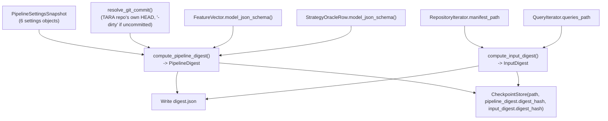
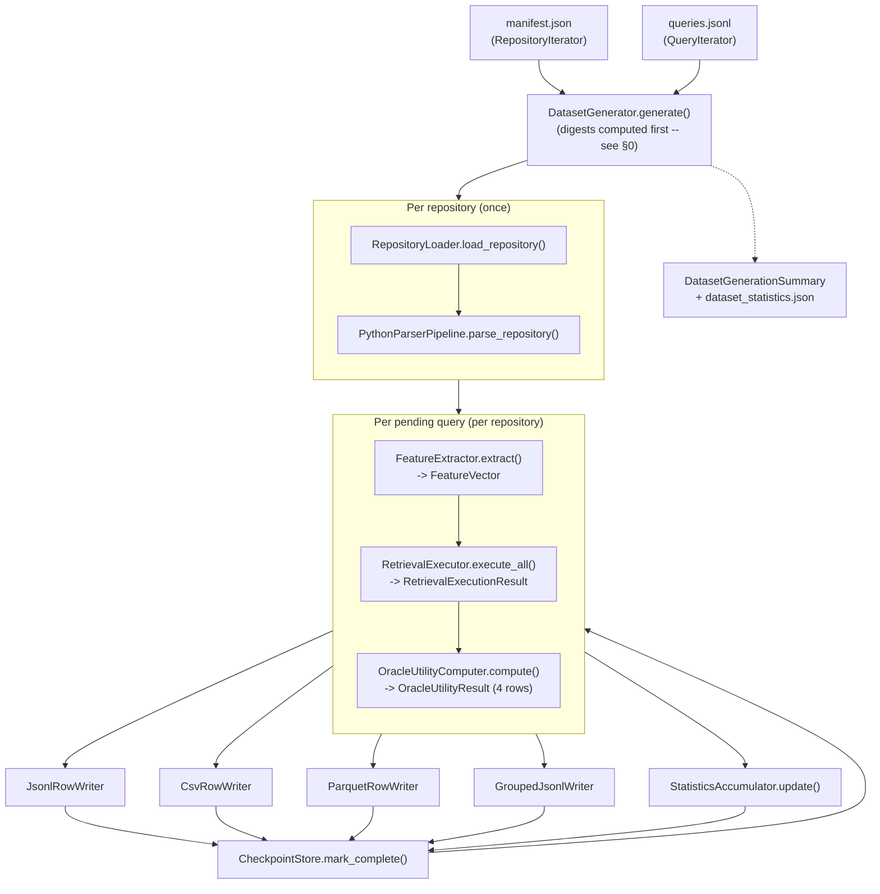
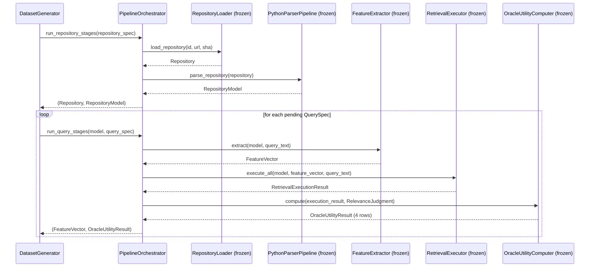
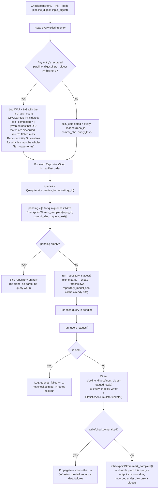
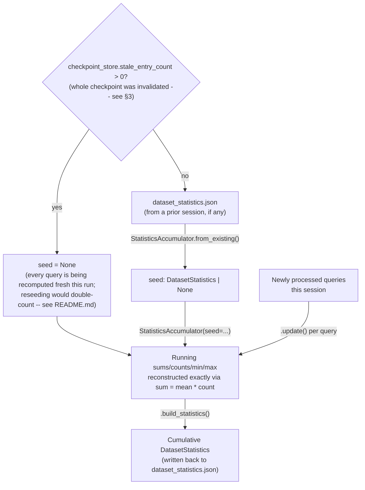
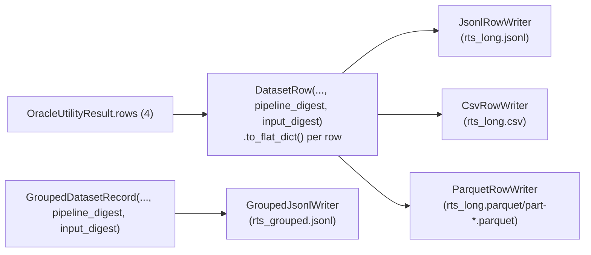

# Pipeline.md — RTS Builder Dataset Builder (Milestone 7)

The complete data flow: from a repository manifest and a queries file,
through all six frozen pipeline stages, to the exported RTS dataset.

## 0. Digest computation (Reviewer Minor Revision, runs first)

See §3 for what `CheckpointStore` does with these two digests on load.

## 1. End-to-end pipeline

## 2. Per-repository / per-query split (`PipelineOrchestrator`)

## 3. Checkpoint validation (on load) and the resume decision flow

## 4. Cumulative statistics across sessions

Reseeding is exact, not approximate, because every mean this module
tracks is losslessly reconstructible from `(mean, count)`:
`sum = mean * count`. `repository_ids` (not just `repository_count`) is
what makes reseeding exact for that one field specifically — without
the actual set, a repository partially processed in one session and
completed in a later one would be double-counted.

The `stale_entry_count` gate (Reviewer Minor Revision) is what keeps
this exact even across a digest-invalidating change: without it, a
recomputed query's contribution would be counted twice -- once already
baked into the stale seed, once fresh. See `README.md`'s Reproducibility
Guarantees and `REVIEW_RESPONSE.md` for the full account of why this
gate exists.

## 5. Export fan-out

Every query's `(FeatureVector, OracleUtilityResult)` pair fans out to
every *enabled* writer independently — none of the four writers depends
on another's success or failure ordering:

Every row/record carries the digests of the run that produced it
(Reviewer Minor Revision) -- see `README.md`'s Reproducibility
Guarantees for why this matters specifically when a digest change
causes rows to be recomputed and appended alongside a prior run's
now-superseded ones.
