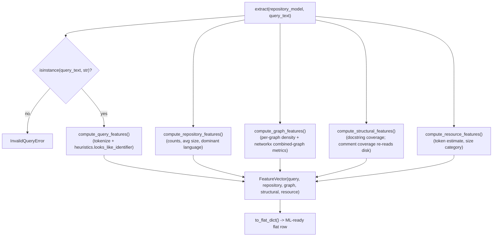

# RTS Builder — Feature Extraction (Milestone 4)

Converts a `RepositoryModel` (Parser's output — Python-only V1,
accepted and **frozen**) plus a developer query into a normalized
`FeatureVector`: five feature groups (Query, Repository, Graph,
Structural, Resource), suitable for machine learning.

> See [`FEATURE_CATALOG.md`](FEATURE_CATALOG.md) for the full feature
> reference (name, type, exact formula, group) and
> [`REVIEW_RESPONSE.md`](REVIEW_RESPONSE.md) for an anticipated
> -reviewer self-assessment of this design's known limitations.

## Scope

Input: `(RepositoryModel, query_text: str)`. Output: `FeatureVector`.

1. Query Features — query length, identifier count, API token count, keyword indicators, query complexity.
2. Repository Features — file/function/class/module count, average file size, dominant language.
3. Graph Features — import/call/inheritance graph density, connected components, average degree.
4. Structural Features — average functions/classes per file, docstring coverage, comment coverage.
5. Resource Features — estimated repository tokens, repository size category.

Task classification, oracle utility computation, retrieval, the router,
the planner, Learning-to-Rank, embeddings, and the LLM interface are
later RTS Builder milestones and are not present here.

## Relationship to `docs/DATASET_BUILDER_SPEC.md` §6

This milestone's feature groups and exact feature names **deliberately
diverge** from `DATASET_BUILDER_SPEC.md` §6's original table, and that
divergence is worth stating plainly rather than leaving implicit.
That table was written assuming: a `RepositoryContext` input (from
`tara.context`, multi-language, embedding-capable) and a completed
Task Annotation stage (`TaskClassification` feeding a `Task` feature
group). Neither holds in this project's actual, evolved implementation
path — Repository Loader → Parser were rebuilt as a self-contained,
Python-only pipeline producing `RepositoryModel`, and Task
Classification/Annotation has not been implemented and is explicitly
excluded from this milestone's scope. This implementation follows the
concrete, narrower specification given directly for this milestone
instead of the original planning document, and does not include a Task
feature group.

## Usage

```python
from evaluation.rts_builder.feature_extraction.extractor import FeatureExtractor

extractor = FeatureExtractor()
vector = extractor.extract(repository_model, "How do I fix the bug in Dog.bark()?")

training_row = vector.to_flat_dict()  # {"query_length": 36, "repo_file_count": 3, ...}
```

## Architecture



Each group is computed by one pure function in its own module
(`query_features.py`, `repository_features.py`, `graph_features.py`,
`structural_features.py`, `resource_features.py`), taking a
`RepositoryModel` (and, where needed, `FeatureExtractionSettings`) and
returning that group's Pydantic sub-model. `extractor.FeatureExtractor`
is the only place that calls all five and assembles the result — no
group function depends on any other's output.

## Design Decisions

- **Five sub-models, not one flat model.** `FeatureVector` mirrors the
  specification's own five named groups directly, so the schema stays
  traceable to the requirement it implements; `to_flat_dict()` is the
  single, explicit flattening step for ML consumption, rather than the
  model being flat (and thus ungrouped/undocumented) from the start.
- **Reuses `tara.classification.heuristics`' tokenizer and identifier
  -shape predicates, not the Task Classifier.** `tokenize` and
  `looks_like_identifier` are the same low-level, stateless primitives
  `tara.retrieval.utils.tokenize_for_search` already reuses for BM25
  indexing — pure functions with no `TaskType`, no confidence score, no
  rule engine. Reusing them for `identifier_count` avoids reimplementing
  an already-tested case-pattern detector; it does not implement any
  part of the excluded Task Classifier. See `REVIEW_RESPONSE.md`.
- **`identifier_count` and `api_token_count` are disjoint by
  construction, not by extra filtering.** `looks_like_identifier`'s
  patterns are anchored over single-segment tokens (`^...$` on
  alnum/underscore only), so a dotted compound token like `self.fooBar`
  never matches it — `api_token_count`'s `"." in token` check and
  `identifier_count`'s pattern check partition the token stream instead
  of double-counting the same token under two categories.
  `tara.classification.heuristics.tokenize`'s own `_WORD_PATTERN`
  already treats a dotted sequence as one token, which is exactly the
  behavior `api_token_count` depends on.
- **`query_complexity` is a documented heuristic, not a validated
  score.** A weighted combination of three independently-clamped [0,1]
  sub-signals (normalized word count, identifier density, clause
  count), with weights and normalization constants in
  `FeatureExtractionSettings` (validated to sum to 1.0). Stated
  explicitly as a simple, explainable placeholder — mirroring
  `docs/DATASET_BUILDER_SPEC.md`'s own "proposed default requiring
  pilot calibration" language for its Utility formula's `lambda` — not
  presented as a settled, empirically-validated formula.
- **Graph density uses `edges / max(nodes, 1)`, matching
  `docs/DATASET_BUILDER_SPEC.md` §6's existing `graph_density`
  convention**, not the combinatorial `edges / (nodes * (nodes-1))`
  definition — for consistency with a convention this project has
  already established, rather than introducing a second, differently
  -scaled notion of "density." Each of the three densities is
  normalized against the node population actually relevant to that
  graph (files for imports, functions for calls, classes for
  inheritance), not a single shared denominator.
- **`connected_components`/`avg_degree` need one shared graph;
  `graph_builder.py` projects all three onto files via `networkx`.**
  Import edges are already file-to-file; call and inheritance edges
  connect symbol ids (a disjoint id space from file paths), so each is
  projected onto the file its endpoint symbol is defined in before
  being added to one combined, undirected `networkx.Graph`. Same-file
  edges are skipped as self-loops (they never affect cross-file
  connectivity). `networkx` is already a project dependency, used here
  as a general graph-algorithms library, not by importing
  `tara.context`'s specific node/edge vocabulary.
- **`comment_coverage_ratio` re-reads source files from disk via
  `RepositoryModel.root_path` and Python's stdlib `tokenize` module.**
  The one feature in this subsystem that isn't computable from
  `RepositoryModel`'s own data at all: Python's `ast` module (which
  `evaluation.rts_builder.parser` is built on) discards comments
  entirely, so no comment information exists anywhere in
  `RepositoryModel` to read. Using `tokenize.generate_tokens` (not a
  naive `^\s*#` line regex) correctly avoids false positives on a `#`
  character inside a string literal. This is an explicit, documented
  exception to "receives RepositoryModel + Developer Query," not a
  silent one — see `REVIEW_RESPONSE.md`; it degrades gracefully
  (returns `0.0`, never raises) if the source is no longer accessible
  or `enable_comment_coverage=False`.
- **`dominant_language` is a near-constant, not a rich signal, in this
  V1.** `RepositoryModel` only ever contains Python files (Parser V1's
  own scope boundary), so this feature is `Language.PYTHON` whenever
  there's at least one file, `Language.UNKNOWN` otherwise — included
  for forward-compatibility with a future multi-language Parser
  version, not because it's currently informative. Documented rather
  than silently trivial.
- **`module_count` is deliberately coarser than `file_count`**: the
  number of distinct top-level packages/modules (grouped by first path
  segment), not a per-file count, which `file_count` already reports.
  Two features with the same value would carry no extra information.
- **Graceful degradation, not `RepositoryStateError`, for a stale
  repository.** Unlike Parser, which hard-fails if the repository was
  mutated since loading (exact-commit correctness is safety-critical
  there), Feature Extraction only reads auxiliary structural signals
  from disk (`comment_coverage_ratio`) and degrades that one feature to
  `0.0` with a logged warning rather than failing the whole vector —
  appropriate since `RepositoryModel`'s own data (everything else in
  this subsystem) is unaffected either way.
