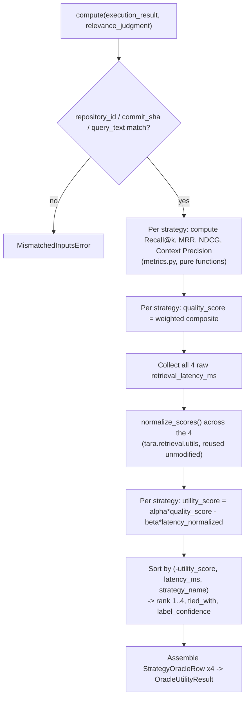

# Architecture.md — RTS Builder Oracle Utility (Milestone 6)

Converts a `RetrievalExecutionResult` (Retrieval Executor's output —
accepted and **frozen**) plus a `RelevanceJudgment` (externally
supplied ground truth) into an `OracleUtilityResult`: the supervision
labels for the RTS dataset's Learning-to-Rank training data.

> See [`Oracle_Math.md`](Oracle_Math.md) for the full mathematical
> formulation and [`REVIEW_RESPONSE.md`](REVIEW_RESPONSE.md) for an
> anticipated-reviewer self-assessment of this design's known
> limitations.

## Scope

Input: `(RetrievalExecutionResult, RelevanceJudgment)`. Output:
`OracleUtilityResult` — four `StrategyOracleRow`s (one per strategy),
each carrying:

1. Retrieval Quality metrics — Recall@k, MRR, NDCG, Context Precision, and their weighted composite `quality_score`.
2. Latency, normalized per the frozen protocol (`retrieval_executor.latency_protocol`).
3. Utility — `alpha*Quality - beta*Latency_normalized`, configuration-driven weights.
4. Strategy ranking — rank, `is_best_strategy`, `label_confidence`, `tied_with`.
5. A schema suitable for Learning-to-Rank — one flat row per `(query, strategy)` pair.

Learning-to-Rank model training, the planner, task classification, the
LLM interface, and the dataset builder are later RTS Builder milestones
and are not present here.

## Usage

```python
from evaluation.rts_builder.oracle_utility.computer import OracleUtilityComputer
from evaluation.rts_builder.oracle_utility.models import RelevanceJudgment

judgment = RelevanceJudgment(
    repository_id=execution_result.repository_id,
    commit_sha=execution_result.commit_sha,
    query_text=execution_result.query_text,
    relevance_grades={"app.py": 2.0, "pkg/base.py": 1.0},  # externally authored, not computed here
)

result = OracleUtilityComputer().compute(execution_result, judgment)

for row in result.rows:  # already sorted by rank ascending
    print(row.rank, row.strategy_name.value, row.utility_score, row.label_confidence)

training_rows = result.to_long_format_rows()  # flat, LTR-ready
```

## Architecture



### Module responsibilities

| Module | Responsibility |
|---|---|
| `metrics.py` | Pure Recall@k / MRR / NDCG@k / Context Precision functions — no dependency on any Oracle Utility model. |
| `models.py` | `RelevanceJudgment` (required ground-truth input), `QualityMetrics`, `StrategyOracleRow`, `OracleUtilityResult`. |
| `config.py` | `OracleUtilitySettings` — every weight/coefficient/epsilon in `Oracle_Math.md`. |
| `computer.py` | `OracleUtilityComputer` — orchestrates quality → latency normalization → utility → ranking → row assembly. |
| `exceptions.py` | `MismatchedInputsError` — the one validation this subsystem performs. |

## Design Decisions

- **`RelevanceJudgment` is a required, externally-supplied input, not
  something this subsystem computes.** Recall@k/MRR/NDCG/Context
  Precision are structurally impossible to compute without a
  ground-truth notion of "which files are actually relevant" — no
  frozen upstream milestone produces this (Feature Extraction and
  Retrieval Executor operate on structure and queries, never on
  relevance judgments), and producing it would require either human
  annotation or an LLM judge, both explicitly out of this milestone's
  scope (`Task Classifier`, `LLM` are excluded). This mirrors this
  project's own earlier research-planning resolution
  (`docs/PILOT_EXECUTION_PLAN.md` §4, which folds relevant-context
  ground-truth annotation into the RTS pipeline's query-authoring
  process specifically because no automated stage produces it) —
  implemented here, not reinvented.
- **Graded, not binary-only, relevance.** `relevance_grades: dict[str, float]`
  supports both binary relevance (grade `1.0`) and graded relevance
  (e.g. `0`/`1`/`2`/`3`) uniformly; NDCG is the only metric that uses
  the graded values directly (via its exponential gain function),
  Recall@k/MRR/Context Precision derive a binary "relevant" set via
  `grade > 0`. One input schema serves both annotation styles rather
  than requiring two.
- **Quality is a configurable, weighted composite of all four metrics,
  not a single chosen metric.** Mirrors the same "name several signals,
  combine via configurable weights validated to sum to 1" pattern
  already used throughout the RTS Builder (Lexical Retrieval's three
  sub-signals, Hybrid Retrieval's three strategy scores, Feature
  Extraction's `query_complexity`) — chosen over picking one metric
  (e.g. Recall@k alone, as `docs/DATASET_BUILDER_SPEC.md` §8's v1
  default does) so no single metric's blind spot (e.g. Recall@k's
  insensitivity to rank order, which NDCG specifically corrects for)
  silently dominates the label.
- **Latency normalization reuses `tara.retrieval.utils.normalize_scores`
  unmodified**, applied across the 4 strategies for one query — the
  exact function and per-query (not global) scope
  `docs/DATASET_BUILDER_SPEC.md` §8 already specifies, just applied to
  4 candidates instead of that document's originally-planned 7 (see
  "Relationship to `docs/DATASET_BUILDER_SPEC.md`" below).
- **Utility's tie-break uses measured per-query latency, not a static
  `RETRIEVER_EXECUTION_PRIORITY` table.** `docs/DATASET_BUILDER_SPEC.md`
  §9 breaks utility ties "by ascending strategy_cost_rank," via a
  static priority table designed for `tara.routing.strategy`'s
  7-candidate taxonomy — a table with no defined entries for Retrieval
  Executor's actual 4 strategies (Lexical/Dense/Graph/Hybrid), and
  reusing it would require inventing a new, unvalidated mapping between
  two different strategy taxonomies. Using each strategy's own already
  -measured `retrieval_latency_ms` for the exact query being ranked
  realizes the identical stated principle ("the cheaper strategy ranks
  higher") with real, per-query cost data instead of a static,
  context-independent ranking — a more accurate instance of the same
  rule, not a different rule. See `Oracle_Math.md` and
  `REVIEW_RESPONSE.md`.
- **`label_confidence` is query-level, not per-strategy**, computed
  once from the top-1/top-2 utility margin and repeated identically on
  all four of a query's rows — matching
  `docs/DATASET_BUILDER_SPEC.md` §9's formula and stated design exactly
  (a single scalar per query, present on every row so no join is
  required to train on it).
- **A strict, always-total `rank` (1–4, no duplicates) is kept separate
  from `tied_with` (informational near-tie detection).** `rank` must be
  a valid permutation for "Strategy ranking: sort by Utility" to be
  well-defined at all; `tied_with` (threshold `tie_epsilon`) tells a
  downstream consumer when that strict order is closer to arbitrary
  than meaningful, without weakening the guarantee that `rank` is
  always assignable.
- **`StrategyOracleRow` is the long-format row itself, not two separate
  "utility" and "ranking" objects joined later.** Every field a
  Learning-to-Rank trainer needs for one `(query, strategy)` pair lives
  on one row — quality, latency, utility, rank, and confidence together
  — directly satisfying "Output schema suitable for Learning-to-Rank"
  as a literal, ready-to-flatten table row
  (`StrategyOracleRow.to_flat_dict`, mirroring `FeatureVector.to_flat_dict`'s
  established convention) rather than a structure requiring assembly
  before use.

## Relationship to `docs/DATASET_BUILDER_SPEC.md` §8-9

Unlike Feature Extraction's and the first Parser's divergence from
their respective planning sections, this milestone's formulas are
**closely aligned** with `docs/DATASET_BUILDER_SPEC.md` §8-9, not a
departure from them — that document's Utility/ranking/confidence
mathematics were written generally enough to transfer directly from a
7-candidate `RoutingStrategy` taxonomy to Retrieval Executor's actual 4
strategies. The two adaptations made explicit above (measured-latency
tie-break instead of a static priority table; an added $\alpha$ weight
generalizing $\text{Utility} = \text{Quality} - \lambda \cdot \text{Latency}_{\text{norm}}$
to $\alpha \cdot \text{Quality} - \beta \cdot \text{Latency}_{\text{norm}}$)
are the only two deviations, both reconciling the original design with
what actually exists three milestones later, not silently overriding
it.

## Failure Modes

| Failure | Raised as / Behavior | Notes |
|---|---|---|
| `relevance_judgment` was authored for a different repository, commit, or query text | `MismatchedInputsError` | Same class of cross-milestone consistency bug caught proactively throughout the RTS Builder (`RetrievalExecutor`'s own `MismatchedInputsError`, `ParserPipeline`'s commit check). |
| `relevance_grades` is empty (no ground truth at all) | Not raised; every strategy's `quality_score` degrades to `0.0` | Ranking then falls back entirely to latency (the fastest strategy wins) — a defensible, non-crashing degenerate case, not a silent wrong answer. See `REVIEW_RESPONSE.md`. |
| A strategy retrieved zero files | Not raised; that strategy's `recall_at_k`/`mrr`/`context_precision` are all `0.0` | Expected, not an edge case requiring special handling — see `metrics.py`'s zero-division guards. |
| All 4 strategies have identical `retrieval_latency_ms` | Not raised; `normalize_scores`'s documented all-tied convention maps every strategy to `latency_normalized = 1.0` | Every strategy is penalized identically, so relative ranking is unaffected — only every `utility_score` shifts down by the same constant `beta`. |
| `utility_quality_weight` (alpha) is 0 or negative, or `utility_latency_weight` (beta) is negative | `pydantic.ValidationError` at `OracleUtilitySettings` construction | A non-positive `alpha` makes Quality irrelevant to Utility (degenerate); a negative `beta` would reward slower strategies — both are almost certainly configuration mistakes, rejected at construction rather than producing a silently-nonsensical label. |
| `quality_*_weight` fields don't sum to 1.0 | `pydantic.ValidationError` at `OracleUtilitySettings` construction | Would otherwise make `quality_score` fall outside `[0,1]`, breaking the bounded-Utility-range guarantee. |
