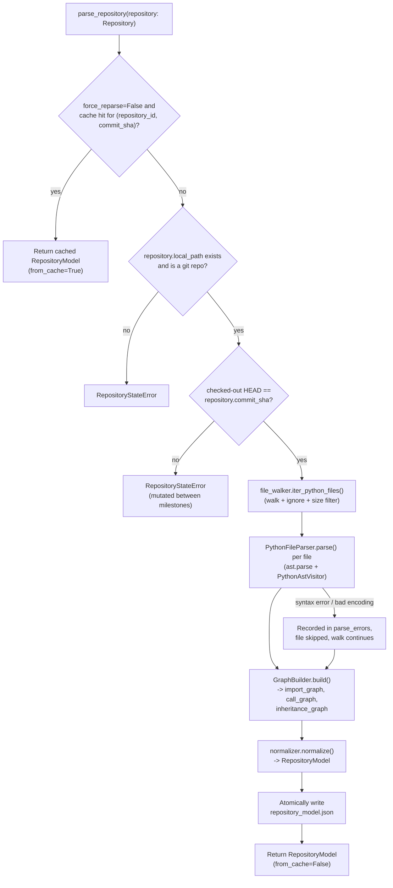

# RTS Builder — Parser (Python-only V1)

Converts a pinned `Repository` (Repository Loader's output — accepted
and **frozen**, not modified by this milestone) into a normalized
`RepositoryModel`: files, imports, functions, classes, methods,
decorators, docstrings, and line numbers, plus an import graph, a call
graph, and a class inheritance graph — exportable as JSON.

**Only Python (`.py`/`.pyi`) is supported in this version.** A non
-Python file sitting anywhere in the repository is simply not selected
by the walk; it is not an error.

> This is a from-scratch, self-contained design, not an extension of an
> earlier multi-language Parser implementation this milestone replaces
> (see "Design Decisions" for why it does not reuse `tara.parsing`).
> See [`REVIEW_RESPONSE.md`](REVIEW_RESPONSE.md) for an
> anticipated-reviewer self-assessment of this design's known
> precision/recall tradeoffs.

## Scope

1. Walk repository files — `file_walker.iter_python_files`.
2. Ignore excluded paths — same function, ignore-directory + size filters.
3. Parse Python AST — `file_parser.PythonFileParser`, via the standard library `ast` module.
4. Extract files, imports, functions, classes, methods, decorators, docstrings, line numbers — `ast_visitor.PythonAstVisitor`.
5. *(combined with 4 above; not a separate step in this design — see "Design Decisions.")*
6. Build the import graph, call graph, and class inheritance graph — `graph_builder.GraphBuilder`.
7. Produce a normalized `RepositoryModel` and export JSON — `normalizer.normalize`, `export.export_repository_model`.

Feature extraction, oracle utility computation, retrieval, embeddings,
the router, the planner, and the LLM interface are later RTS Builder
milestones and are not present here.

## Usage

```python
from evaluation.rts_builder.repository_loader import RepositoryLoader
from evaluation.rts_builder.parser.pipeline import PythonParserPipeline

repository = RepositoryLoader().load_repository(
    repository_id="psf-requests",
    source_url="https://github.com/psf/requests.git",
    commit_sha="<full 40-character pinned commit sha>",
)

model = PythonParserPipeline().parse_repository(repository)

print(len(model.top_level_functions), len(model.methods), len(model.classes))
print(model.call_graph[:5])
```

A second `parse_repository(repository)` call for the same
`(repository_id, commit_sha)` returns the cached result
(`model.from_cache is True`) without re-parsing. Export explicitly at
any point:

```python
from evaluation.rts_builder.parser.export import export_repository_model

export_repository_model(model, Path("out/repository_model.json"))
```

## Configuration

All settings are optional and environment-driven via `ParserSettings`
(prefix `RTS_PARSER_`). See [`.env.example`](.env.example):

| Variable | Default | Purpose |
|---|---|---|
| `RTS_PARSER_CACHE_ROOT` | `.rts_cache/parsed` | Where `repository_model.json` cache entries are written. |
| `RTS_PARSER_FORCE_REPARSE` | `false` | Ignore any existing cache entry and always re-parse. |
| `RTS_PARSER_MAX_FILE_SIZE_BYTES` | `2000000` | Files larger than this are skipped by the walk. |
| `RTS_PARSER_IGNORED_DIRECTORIES` | `[]` | Extra directory names to exclude, beyond the built-in defaults. |
| `RTS_PARSER_ENABLE_CALL_GRAPH` | `true` | Whether to build the call graph at all. |
| `RTS_PARSER_ENABLE_INHERITANCE_GRAPH` | `true` | Whether to build the inheritance graph at all. |

## Architecture



### Module responsibilities

| Module | Responsibility |
|---|---|
| `file_walker.py` | Walk + ignore-directory + size filtering. |
| `ast_visitor.py` | Single-pass `ast.NodeVisitor`: imports, functions, classes, decorators, docstrings, call sites, with lexical scope tracking. |
| `file_parser.py` | Per-file orchestration: read, decode, `ast.parse`, run the visitor. |
| `repository_parser.py` | Repository-wide walk + parse, tolerating individual file failures. |
| `graph_builder.py` | Name-based resolution of the import, call, and inheritance graphs. |
| `models.py` | The normalized, JSON-serializable `RepositoryModel` and its parts. |
| `normalizer.py` | Pure projection of parsed files + graphs into `RepositoryModel`. |
| `export.py` | The one atomic JSON-writing code path (requirement 7). |
| `cache.py` | Commit-level incremental-parsing cache, built on `export.py`. |
| `pipeline.py` | `PythonParserPipeline`: orchestrates all of the above. |

## Design Decisions

- **Self-contained; does not reuse `tara.parsing`/`tara.context`.** The
  previous (superseded) Parser implementation reused
  `TreeSitterRepositoryParser`/`GraphBuilder` because it had to cover 8
  languages. This version is explicitly Python-only, and Python's own
  standard library `ast` module gives structurally correct, semantically
  precise access to exactly what this spec asks for —
  `decorator_list`, `ast.get_docstring`, `ClassDef.bases` — that a
  generic multi-language Tree-sitter walk could only approximate (the
  previous `CodeSymbol` model, for instance, had no decorator field at
  all). Building a lean, purpose-built pipeline around `ast` is a better
  fit for a Python-only V1 than force-fitting compatibility with
  multi-language infrastructure this version doesn't need.
- **One visitor pass extracts imports, functions, classes, *and* call
  sites together (steps 4 and part of 6 are one traversal, not two).**
  `ast.NodeVisitor`'s natural recursive traversal already tracks lexical
  scope as it descends and un-descends; reusing that same scope stack to
  attribute each call site to its innermost enclosing function is both
  simpler and more precise than the previous design's separate
  line-range-containment search over a flat symbol list.
- **1-indexed line numbers** (`ast`'s native convention), not the
  0-indexed convention the previous, Tree-sitter-based design used.
  Documented explicitly here since it's a real, deliberate difference
  from that earlier design, not an oversight: forcing a translation
  would only add a subtraction-bug surface for no benefit, and
  1-indexed lines are what a human reading a traceback or an editor
  gutter already expects.
- **Decorators are stored as their unparsed source expression, without
  the leading `@`** (e.g. `"staticmethod"`, `"functools.wraps(helper)"`),
  via `ast.unparse` (available since Python 3.9; this project targets
  3.12). Chosen over re-deriving a decorator's semantic effect (which
  would require actually resolving what the decorator does) — this
  milestone extracts structure, not behavior.
- **Python module-path-aware import resolution, not stem-matching.**
  Being Python-only makes it possible to replicate real Python import
  semantics closely: a `module_path_to_file` index (`pkg/sub/mod.py` ->
  `"pkg.sub.mod"`, `pkg/sub/__init__.py` -> `"pkg.sub"`) plus level
  -aware relative-import resolution (walking up `level - 1` package
  levels from the importing file's own package, per Python's own
  semantics), meaningfully more accurate than the previous design's
  cross-language stem-matching heuristic. Still best-effort: an import
  resolves only when its target is unambiguously a file actually parsed
  in this repository; external/third-party imports are recorded in
  `RepositoryModel.imports` but never produce an `import_graph` edge.
- **Call and inheritance resolution are name-based, ambiguity skipped,
  not guessed at.** Same precedent as the previous milestone's call
  graph and `tara.context.GraphBuilder`'s own import resolution: a
  wrong edge is worse than a missing one for anything built on this
  graph later. `"object"` is explicitly excluded from the inheritance
  graph — every class inherits from it, so recording that edge would be
  noise, not a meaningful relationship.
- **`top_level_functions` / `methods` are computed properties, not
  stored lists.** `NormalizedFunction.is_method` already discriminates
  them; storing both a flat `functions` list and two filtered copies
  would only invite the copies to drift.
- **A single symbol-id convention (`symbol_ids.py`), shared by
  `graph_builder.py` and `normalizer.py`.** Both need to agree on the
  same id for the same symbol (one builds the name-lookup indices calls
  and inheritance resolve against; the other assigns the id
  `NormalizedFunction`/`NormalizedClass` actually carry) — centralizing
  the convention in one function is what guarantees that, rather than
  relying on two call sites staying in sync by convention.
- **Exactly one JSON-writing code path (`export.py`), used both for
  direct export and by the cache.** Requirement 7 ("Export JSON") and
  "Incremental parsing support" are not two independent capabilities
  with two serialization implementations; the cache's every fresh-parse
  write *is* a JSON export, just one immediately followed by an atomic
  rename to a deterministic path.
- **A defensive commit-consistency check between Loader and Parser**
  (same rationale as the previous milestone): `RepositoryLoader`'s lock
  is released once `load_repository()` returns, so this pipeline
  independently re-reads `local_path`'s HEAD via GitPython and compares
  it against `repository.commit_sha` before parsing, raising
  `RepositoryStateError` on any mismatch.

## Failure Modes

| Failure | Raised as | Notes |
|---|---|---|
| `repository.local_path` does not exist | `RepositoryStateError` | The repository was never loaded, or its clone was removed after loading. |
| `repository.local_path` is not a git repository | `RepositoryStateError` | E.g. it was replaced by something else after loading. |
| Repository was mutated (different commit checked out) between Loader and Parser stages | `RepositoryStateError` | Detected by comparing the freshly re-read HEAD against `repository.commit_sha`. |
| A file fails to decode as UTF-8, or has a Python syntax error | Not raised; recorded in `RepositoryModel.parse_errors` | A single bad file never aborts the rest of the walk. |
| `repository_model.json` cannot be written (disk full, permissions) | `ParserCacheError` | Cache *reads* never raise -- a corrupt/unreadable cache entry is treated as a miss and logged. |
| A call site's or base class's name matches zero or more than one candidate in the repository | Not raised; silently omitted from `call_graph`/`inheritance_graph` | The dominant, expected outcome for calls/bases from external libraries, not an edge case -- see `REVIEW_RESPONSE.md`. |
| An import's target isn't a file parsed in this repository | Not raised; the statement still appears in `RepositoryModel.imports`, just not in `import_graph` | Expected for every external/third-party import. |
