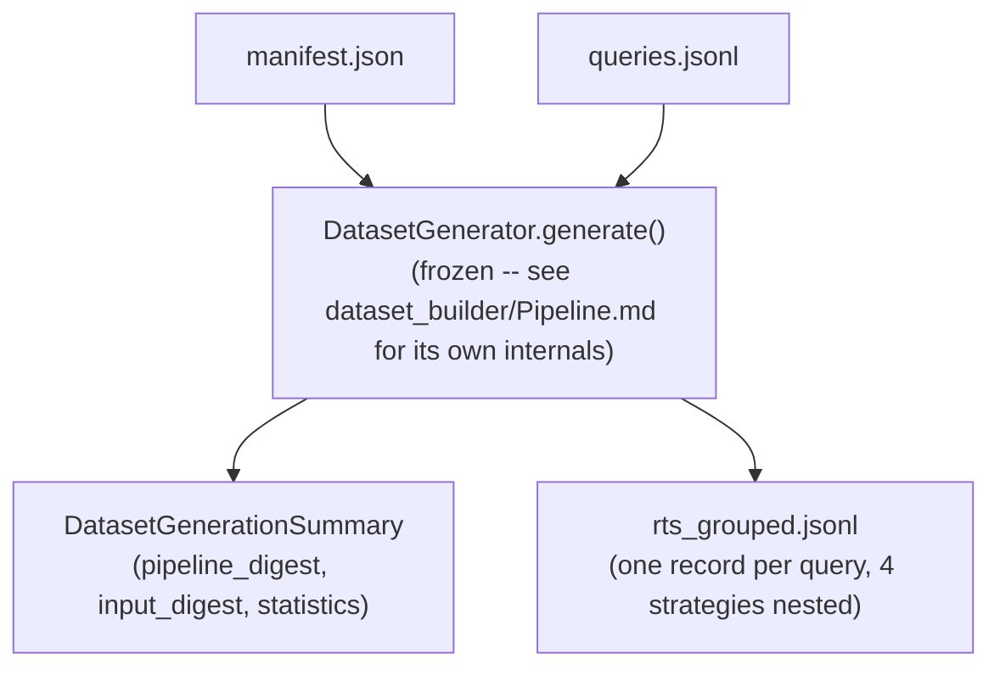
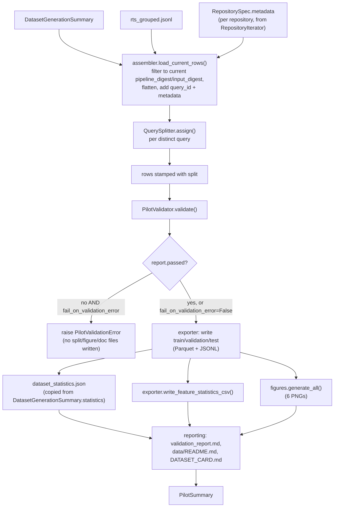
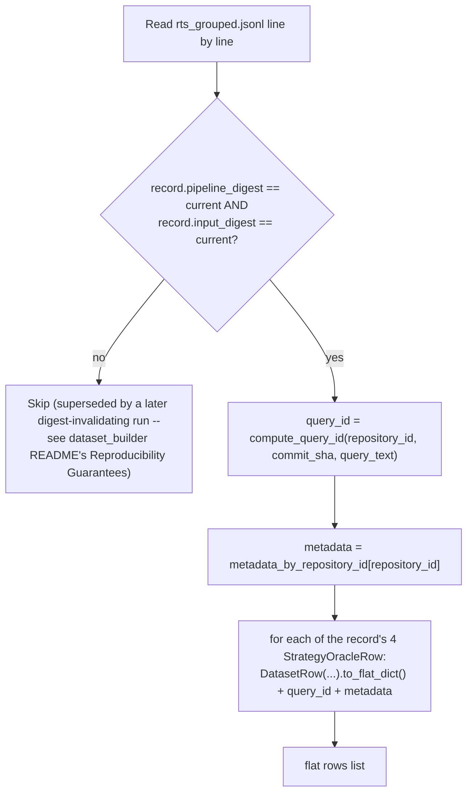
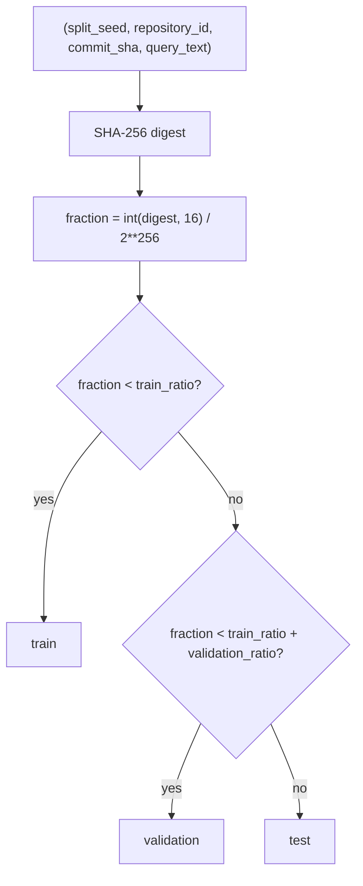
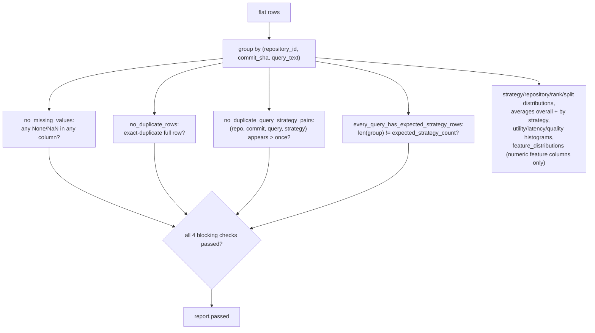
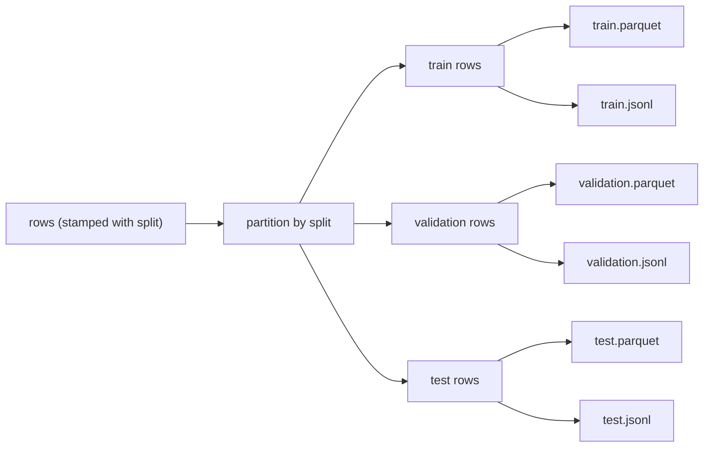

# Architecture.md — RTS Builder Pilot

The complete data flow: from Dataset Builder's own generation run,
through digest-filtering, splitting, validation, and export, to the
documented pilot dataset.

## 0. Where this subsystem starts (Dataset Builder is frozen and unmodified)

Everything below this line is new at the Pilot subsystem; everything
above is Dataset Builder's own, already-accepted pipeline, invoked
exactly as documented in its own `README.md`/`Pipeline.md`.

## 1. End-to-end pilot pipeline

## 2. Row assembly (`assembler.load_current_rows`)

This is the same digest-filtering Dataset Builder's own `README.md`
documents as the way a downstream consumer recovers the current,
de-duplicated view after a digest-invalidating change non-destructively
appends recomputed rows — the Pilot subsystem is exactly that kind of
downstream consumer.

## 3. Split assignment (`QuerySplitter.assign`)

Pure function of the query's own identity plus the configured seed and
ratios — no shuffling, no in-memory population, no dependency on
processing order or on any other query's presence. All four of a
query's strategy rows call this with identical arguments (strategy is
never a parameter), so they always land in the same split together.

## 4. Validation (`PilotValidator.validate`)

`no_missing_values`/`no_duplicate_rows`/`no_duplicate_query_strategy_pairs`/
`every_query_has_expected_strategy_rows` are the four blocking checks —
see `VALIDATION_GUIDE.md` for how each maps to the pilot's stated
Success Criteria. Everything under `H` is descriptive/informational:
always computed, never blocking.

## 5. Export fan-out

A single Parquet `pa.Schema` is derived once from the *full* (pre-split)
row set and reused for every split's `write_split_parquet` call — this
is what lets an empty split (possible on a tiny/unbalanced input
population) still produce a validly-typed, zero-row Parquet file
instead of failing on missing columns.

## Design boundary: what this subsystem does not touch

Every box above `A` (§2) is Dataset Builder's own, accepted-and-frozen
machinery, invoked exactly as documented in
`evaluation/rts_builder/dataset_builder/Pipeline.md`. No frozen model
(`DatasetRow`, `GroupedDatasetRecord`, `StrategyOracleRow`,
`FeatureVector`, `PipelineDigest`, `InputDigest`, ...) gains a new
field here — `query_id`/`metadata`/`split` exist only as keys on the
plain `dict` rows this subsystem builds and writes, never as attributes
on any frozen Pydantic model.
