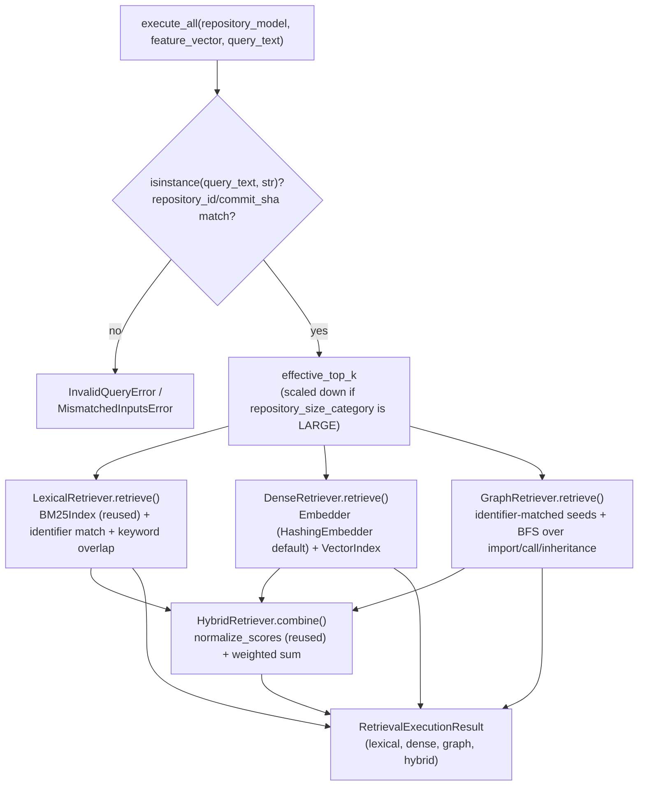

# RTS Builder — Retrieval Executor (Milestone 5)

Given a `RepositoryModel` (Parser's output), a `FeatureVector` (Feature
Extraction's output), and a developer query — all three prior
milestones accepted and **frozen** — executes all four candidate
retrieval strategies (Lexical, Dense, Graph, Hybrid) independently and
unconditionally, collecting each strategy's retrieved files, retrieval
score, retrieval latency, and context token count.

> See [`STRATEGY_COMPARISON.md`](STRATEGY_COMPARISON.md) for a
> side-by-side comparison of the four strategies, and
> [`REVIEW_RESPONSE.md`](REVIEW_RESPONSE.md) for an anticipated
> -reviewer self-assessment and full failure-mode catalog.

## Scope

1. Lexical Retrieval — BM25 + exact identifier matching + keyword matching, blended.
2. Dense Retrieval — embedding-based retrieval, pluggable embedding backend, vector index abstraction.
3. Graph Retrieval — import/call graph traversal, dependency-aware (hop-decayed) expansion.
4. Hybrid Retrieval — weighted combination of the other three strategies' already-computed scores.

Every strategy runs for every query, unconditionally — this milestone
never decides which strategy to use (that is the excluded Router
/Planner's job); it produces the full, independent set of results a
later oracle-labeling stage needs.

Oracle utility computation, the planner, Learning-to-Rank, task
classification, the LLM interface, and the dataset writer are later RTS
Builder milestones and are not present here.

## Usage

```python
from evaluation.rts_builder.retrieval_executor.executor import RetrievalExecutor

executor = RetrievalExecutor()
result = executor.execute_all(repository_model, feature_vector, "How does Dog bark?")

for strategy_result in result.all_results():
    print(strategy_result.strategy_name, strategy_result.retrieved_files, strategy_result.retrieval_latency_ms)
```

## Hybrid Score Normalization (frozen, Reviewer #2 Revision 1)

For every query, each of Lexical, Dense, and Graph retrieval's own
`retrieved_files` scores is **independently min-max normalized**
(`tara.retrieval.utils.normalize_scores`, reused unmodified) before
combination:

$$
s'_i = \begin{cases} \dfrac{s_i - \min(S)}{\max(S) - \min(S)} & \text{if } \max(S) \neq \min(S) \\[4pt] 1.0 & \text{if } \max(S) = \min(S) \text{ (including } |S| = 1\text{)} \end{cases}
$$

where $S$ is one strategy's own set of raw scores over its own
retrieved files (**not** the union across strategies — a file Dense
retrieved but Lexical didn't is simply absent from Lexical's $S$, and
contributes $0$ to Lexical's term below, not a normalized score of its
own). The all-tied case mapping to $1.0$ rather than dividing by zero
is `normalize_scores`'s own existing, documented convention — a tie
among the only candidates present is not evidence of low relevance.

The combined Hybrid score for a file $f$ in the union of all three
strategies' retrieved files is:

$$
\text{Hybrid}(f) = \alpha \cdot L'(f) + \beta \cdot D'(f) + \gamma \cdot G'(f)
$$

where $L'(f)$, $D'(f)$, $G'(f)$ are $f$'s normalized score under each
strategy (or $0$ if $f$ was not among that strategy's retrieved files),
subject to:

$$
\alpha + \beta + \gamma = 1, \qquad \alpha = \beta = \gamma = \tfrac{1}{3} \text{ (default)}
$$

Implementation: `hybrid_retrieval.py:HybridRetriever.combine`.
Configuration: `RetrievalExecutorSettings.hybrid_lexical_weight` ($\alpha$)
/ `hybrid_dense_weight` ($\beta$) / `hybrid_graph_weight` ($\gamma$),
validated at settings-construction time to sum to $1.0$. This same
formulation is also recorded, in prose, in
[`config.yaml`](config.yaml)'s `hybrid_score_normalization` section and
in [`STRATEGY_COMPARISON.md`](STRATEGY_COMPARISON.md).

This is documentation of already-implemented, unchanged behavior — see
`REVIEW_RESPONSE.md`'s Revision 1 entry — Reviewer #2 asked for the
exact formulation to be written down explicitly, not for a change to
what the code computes.

## Latency Measurement Protocol (frozen, Reviewer #2 Revision 2)

Source of truth: [`latency_protocol.py`](latency_protocol.py) (constants,
importable) and [`config.yaml`](config.yaml) (prose; kept in sync with
`latency_protocol.py` by `test_latency_protocol.py`).

| | |
|---|---|
| **Starts** | Immediately before `retrieve()` is invoked. |
| **Ends** | Immediately after ranked results are returned. |
| **Included** | Embedding generation · Vector search · Graph traversal · Score computation |
| **Excluded** | Repository loading · Index construction · Model download |

Concretely, per strategy:

| Strategy | Included in `retrieval_latency_ms` | Excluded |
|---|---|---|
| Lexical | Query tokenization, BM25 scoring, identifier/keyword-overlap scoring, normalization, combination, ranking | `BM25Index.build` |
| Dense | Document + query embedding generation, vector search | `VectorIndex.build`, per-file document-text assembly |
| Graph | Seed-finding (query-dependent identifier matching), BFS traversal, ranking | File-adjacency-map construction |
| Hybrid | The entire combination step (no index-construction phase exists) | — |

### Design Rationale: Revision 2

**Why "starts immediately before `retrieve()`" doesn't mean "every line
inside `retrieve()` is counted."** The boundary instruction fixes
*where the stopwatch's outer window is* (the public method call, not
some internal helper); the include/exclude list then specifies which
*phases within that window* are actually accumulated into the reported
number. In this milestone's current architecture, index construction
(BM25/vector-index build, the graph file-adjacency map) happens to
execute inside the same `retrieve()` call as the included work, because
nothing is cached across calls yet (a separate, already-documented
limitation — see `REVIEW_RESPONSE.md`'s Retrieval Executor review,
Item 4). Reporting that construction cost as part of "retrieval
latency" would conflate two different things a dataset consumer cares
about separately: the one-time cost of making a repository's
representation searchable, and the per-query cost of actually searching
it. The protocol asks for the latter.

**How the code honors this without changing the architecture.** Each
retriever's `retrieve()` still has the same signature, return type, and
overall control flow as before this revision. What changed internally
is *how the elapsed time is accumulated*: `common.LatencyAccumulator`
lets a retriever open and close multiple timed spans within one
`retrieve()` call, explicitly leaving index-construction code
untimed in between, rather than a single `time.perf_counter()` call at
the top of the method. This is a measurement-boundary fix, not a
redesign — no class was added or removed, no public interface changed,
and no strategy's actual retrieval behavior (which files are retrieved,
what scores they get) changed at all.

## Architecture



### Reused, unmodified

- `tara.retrieval.bm25_index.BM25Index` — generic, corpus-agnostic BM25.
- `tara.retrieval.utils.tokenize_for_search` / `normalize_scores`.
- `tara.context.embedder.Embedder` (the ABC) — `HashingEmbedder` (new, this module) and `SentenceTransformerEmbedder` (existing) are two interchangeable implementations of it.

### New in this milestone

- `document_index.py` — synthetic per-file "document text" from `RepositoryModel`'s structural metadata (no raw source retained by Parser V1).
- `identifier_matching.py` — shared exact-match signal (Lexical's bonus, Graph's seed-finding).
- `embedding_backend.HashingEmbedder` — deterministic, offline default embedder (the "hashing trick").
- `vector_index.py` — `VectorIndex` Protocol + `InMemoryVectorIndex` (brute-force cosine).
- `lexical_retrieval.py`, `dense_retrieval.py`, `graph_retrieval.py`, `hybrid_retrieval.py`, `executor.py`.

## Design Decisions

- **Reuses `BM25Index`/`tokenize_for_search`/`normalize_scores` directly; does not reuse `LexicalRetriever`.**
  `BM25Index` is a pure `(document_id, tokens)` ranker with zero
  `RepositoryContext` coupling — a direct fit. `tara.retrieval.lexical_retriever.LexicalRetriever`
  is tightly coupled to `RepositoryContext`/`SymbolIndex` (byte-offset
  source slicing `RepositoryModel` doesn't carry), so it is not reused;
  this milestone's `LexicalRetriever` is a new, self-contained class
  built on the same underlying algorithm.
- **`tara.context.embedder.Embedder` is reused as the pluggable
  -embedding-backend interface, not redefined.** It's already exactly
  the right shape and already has a real implementation
  (`SentenceTransformerEmbedder`) — reusing it means "pluggable
  embedding backend" is satisfied concretely (two interchangeable real
  implementations exist today), not just as an unused abstraction
  invented to sit beside a single hardcoded backend.
- **`HashingEmbedder`, not `SentenceTransformerEmbedder`, is the
  default.** A real sentence-transformers model requires a network
  download and a `torch` runtime, and its output is not guaranteed
  byte-stable across versions — both are in direct tension with
  "Deterministic execution" and fast, offline test execution.
  `HashingEmbedder` is a legitimate, real embedding technique (feature
  hashing; Weinberger et al., 2009 — the same technique behind scikit
  -learn's `HashingVectorizer`), not a stub: it produces real dense
  vectors from real text, deterministically, with no external
  dependency. `SentenceTransformerEmbedder` remains a genuine drop-in
  option for a production run willing to accept its cost and
  non-determinism.
- **`InMemoryVectorIndex` is brute-force, pure Python, not FAISS**
  (already a project dependency, `faiss-cpu`, but unused here). Correct
  and fast at the scale this subsystem actually operates at — one
  repository's file count — and it avoids introducing FAISS's index
  -type/serialization surface for a workload that doesn't need
  approximate nearest-neighbor search to be fast. `VectorIndex` is a
  `Protocol`, specifically so a FAISS-backed implementation can be
  substituted later without changing `DenseRetriever` — see Future
  Extension Points.
- **Graph Retrieval seeds from exact identifier matches, not lexical
  score.** Seeding from `LexicalRetriever`'s own (weighted, tunable)
  output would make Graph Retrieval's behavior indirectly depend on
  Lexical Retrieval's configuration — two supposedly independent
  strategies would secretly be coupled. Seeding from the same
  underlying exact-match primitive (`identifier_matching.py`) both
  strategies already use avoids that coupling while still sharing the
  one signal that's genuinely common ground between them.
- **The file-level graph projects import, call, *and* inheritance
  edges, all undirected.** "Import graph traversal" and "call graph
  traversal" are named separately in the requirement, but nothing
  requires them to be scored as two separate result sets — a single
  combined, undirected adjacency (call/inheritance edges resolved from
  symbol ids to their owning files, exactly as Feature Extraction's own
  `graph_features.py` projects them, reimplemented here rather than
  imported — see `REVIEW_RESPONSE.md`) is what "dependency-aware
  expansion" (the third named requirement) actually asks for: proximity
  by any structural relationship, not per-relationship-type scoring.
- **Hop-distance decay is `1 / (1 + hop)`, and a file reached via
  multiple paths keeps its *best* (lowest-hop) score** — standard
  multi-source BFS distance tracking, applied here to produce a
  monotonically-decreasing relevance-by-proximity signal rather than a
  binary "reachable or not."
- **Hybrid does not re-run the other three retrievers; it combines
  their already-computed, already-normalized scores.** See
  `hybrid_retrieval.py`'s module docstring: this is both more efficient
  (no duplicated work) and more correct — it guarantees the combination
  is over the *exact* scores independently reported for Lexical/Dense
  /Graph, not a second, potentially-diverging computation.
- **`FeatureVector` is used only to scale `top_k` by repository size,
  never to change retrieval behavior based on query intent.** Using
  `feature_vector.query.has_bug_keyword` (etc.) to alter which files are
  retrieved or how they're scored would begin to implement
  query-adaptive routing — exactly what the excluded Task Classifier
  /Router does. `feature_vector.resource.repository_size_category` is
  used purely for a latency-budget adaptation, deliberately the only
  use made of the required `feature_vector` parameter.
- **Deterministic tie-breaking everywhere**: every strategy ranks by
  `(-score, file_path)` (`common.rank_scores`, and
  `InMemoryVectorIndex.search` independently, matching the same
  convention) — required because `dict`/`set` iteration order is not
  itself a reproducibility guarantee across different code paths
  building logically-equivalent score mappings.
